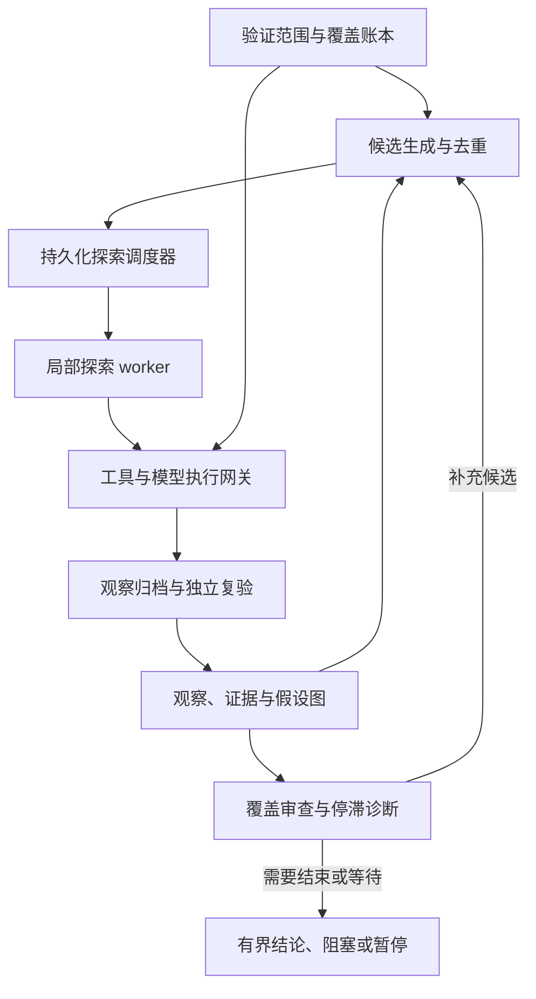

**开放搜索型安全验证 Agent：架构提案 v0.1**

设计日期：2026-09-01。目标是在明确授权、资源与环境约束下，持续推进开放搜索，降低因局部失败、上下文丢失、分支饥饿和过早收尾导致的遗漏。本文是架构提案，不是已经实现的原型，也不声称已证明其业务效果或全局最优性。

**明确判断。** 建议以持久化探索调度器为核心，维护带证据与条件的假设图、候选行动前沿和验证覆盖账本，调用短生命周期的执行worker及独立复验任务。项目是否继续由程序状态与约定的结束政策决定；模型负责提出、执行和评估局部假设。多Agent是并行执行方式，不作为核心正确性的前提。

“最大限度探索”的工程含义应是：在给定授权、资源、工具能力和任务定义下，持续增加有证据支持的覆盖，处理重要未知项，并尽量避免重复无效尝试。“所有办法都已用尽”在开放未知状态空间中通常无法证明；“没有发现漏洞”也不能无条件推出“系统安全”。完成输出应描述范围、版本、测试条件、证据、未测内容和剩余不确定性。

**一、两条相互制约的循环**

探索循环选择值得执行的候选行动，产生观察、支持或反驳假设、开启新方向。覆盖审查循环检查是否只在容易区域重复工作、是否将未测试误标为安全、是否遗漏身份/状态/信任边界等已定义检查维度。一个发现可以关闭某个假设，不能自动关闭整个安全验证项目。

worker的模型与工具请求都经过执行网关；网关统一检查权限、预算和取消。阶段完成、预算暂停、外部阻塞和用户取消分别处理；用户取消不能被自动探索循环重新激活。

**二、最小数据模型**

|对象|主要字段|核心规则|
|---|---|---|
|Campaign|范围版本、环境版本、允许动作、总预算、状态、结束政策|模型不能自行扩大授权、绕过取消或提高预算|
|Observation|原始产物引用、工具/版本、时间、执行条件、身份、环境版本|观察先作为证据保存，不直接等同客观真理|
|Hypothesis|命题、适用条件、支持/反对证据、验证状态、最后检查版本|保留矛盾；模型信心不直接作为统计概率|
|FrontierItem|待查问题、预期可观察结果、前置条件、关联证据、策略类型、预计成本、状态、重开条件|计划和执行状态分离；候选的生成不代表获准执行|
|Attempt|行动指纹、租约、权限/预算票据、运行ID、开始/结束、结果、外部副作用状态|同条件重复要说明新增理由；外部效果不确定时先核对|
|CoverageItem|检查维度、风险优先级、当前证据、已测/未测/受阻/过时、适用范围|分母只覆盖已定义与已发现范围，不宣称覆盖未知全空间|
|CapabilityGap|缺失工具/信息/权限/知识、关联任务、获准补齐方式、状态|能补齐的缺口生成有限子任务；不能补齐则保留阻塞原因|

首版可以用SQLite事务保存这些对象及追加事件表，原始输出放artifact目录，无须先引入独立图数据库。图是关系建模方式，不必等同某个数据库产品。

**三、调度策略：广度、深度、证伪、回访并行考虑**

|队列|目的|何时提高优先级|
|---|---|---|
|覆盖探索|处理已知但未测试的区域，发现新对象和依赖|覆盖偏斜、长期无新区域、关键维度未检查|
|证据驱动深入|跟进已有可靠线索|新证据支持前置条件、预计路径变短|
|证伪复验|验证发现，也挑战先前否定与安全判断|高影响发现、证据冲突、结论证据不足|
|条件变化回访|重新打开以前受阻或暂缓的方向|权限/环境/知识/工具能力变化，证据过时|

候选排序综合风险加权覆盖增益、信息增益、新前置条件的解锁价值、证据质量、估计成本、重复程度和等待时间。首版采用可解释的等级与规则，不把LLM自报成功率直接当校准概率，也不声称得到全局最优行动。

每类队列应有服务机会并限制单分支连续占用。老任务的aging只能影响仍获准、可执行的候选，不能把被拒绝动作重新变成允许动作。昂贵分支可以checkpoint并暂缓；出现相关新证据时重开。难度应成为资源分配信号，而不是永久排除困难问题的理由。

**四、防止无效循环与虚假探索**

尝试去重应结合环境/身份/前置条件/工具版本/规范化动作，不能只对命令字符串比较。重复尝试需要说明有何改变、为何预期不同观察。精确指纹可程序判定；语义相似只应作为审查信号，不能自动合并本来不同的假设。

局部失败至少区分：工具故障、观察无效、缺少前置条件、缺少能力、当前条件下反证、结果不确定。只有足够证据才标记当前条件下反驳；其他情况进入retry/blocked/deferred/uncertain，并保存原因与重开条件。

|现象|处理|
|---|---|
|工具暂态失败|有限重试/退避，或切换获准的等价工具；耗尽后阻塞该方向|
|缺前置条件|创建依赖任务，等待条件改变；其他分支继续|
|同条件反复无新增信息|去重、降优先级或暂缓；要求提出不同可检验假设|
|上下文超限|归档原始证据，重新构建任务上下文；全局探索图保留|
|能力不足|记录可定位的能力缺口，检索已有知识或提出获准的补齐任务|
|所有已生成候选都不可执行|覆盖审查和有限候选生成；仍无行动则进入阻塞或探索平台期，明确所需条件|

研究中，Reflexion使用反馈形成跨尝试反思记忆；这里借鉴的是保存失败原因影响下一轮决策的思路，而非把反思文本当经验证事实。[Reflexion原论文](https://arxiv.org/abs/2303.11366)

**五、保留“以后可以继续”的状态**

每个值得回访的探索位置归档：已知证据、环境/身份、前置条件、可复用产物、待查问题、已排除的条件组合、恢复检查方法。worker会话是临时的；项目进度不随会话结束而消失。

Go-Explore强调保存有希望的已访问状态，先回到它们再探索。这里借鉴状态归档与回访原则；真实系统不能假定可任意重置，因此回访必须先检查条件和证据是否仍有效，不能盲目重放有副作用的动作。[Go-Explore原论文](https://arxiv.org/abs/2004.12919)

**六、持久执行与工具边界**

调度器事务性领取候选并预留预算；worker心跳维护租约；行动发出前保存Attempt意图，结束后保存结果与原始证据。崩溃后的started但未确认Attempt进入uncertain，优先通过外部状态核对；具有幂等键的工具可利用幂等接口。对任意外部系统，不能仅用本地事件日志承诺exactly-once。

所有角色，包括Planner、探索者、复验者和能力补齐任务，都使用同一执行网关。网关强制作用域、工具权限、预算预留/结算、取消和操作记录。模型、摘要、检索改写与验证请求也纳入预算。worker可失败、超时、重建；项目仅在明确停止政策下结束。

**七、结束与继续的权限**

|状态|含义|后续|
|---|---|---|
|running|存在获准且有预算的候选|继续调度，单worker结束不结束项目|
|waiting|工具或已知依赖正在进行|等待事件，不用空转模型调用填时间|
|blocked|缺信息、权限、能力或外部条件|持久化原因，报告需要的输入；条件满足后恢复|
|plateau|有限审查后无新的有意义候选|报告当前范围的探索平台期，不宣称全空间耗尽|
|budget_paused|总预算/时限已达边界|保存进度和下轮候选，等用户调整预算|
|assessment_complete|约定范围与证据要求满足|提交带版本、覆盖、未解决项的有界评估结论|
|cancelled|用户明确停止或授权被撤销|传播取消，禁止新动作，不自动恢复|

局部worker可以声明自己当前任务完成，但不能自行关闭整个Campaign。控制器可触发覆盖审查；审查的模型部分负责找遗漏，程序部分负责检查覆盖项、证据引用、未完成执行和预算。审查模型本身不是业务真相判定器。

**八、独立复验与覆盖审查**

每个报告发现必须关联可读取的原始证据与适用条件。复验者得到命题和证据索引，通过获准的可重复检查、交叉证据或任务专用判定进行复核；高影响结论可要求独立证据。多个LLM对同一摘要投票不能替代这一步。无法复验的结论保留为未确认，不伪装为已证实。

覆盖账本可以按资产、入口、授权身份、业务状态、信任边界和检查类别组织，但不会机械展开所有笛卡尔组合；新增对象会扩展或修订账本。一次风险发现可以满足某个检查项，仍需检查其他范围。报告必须把已测试、未测试、受阻、过时、发现待复验分开。

**九、怎样借鉴前面五套架构**

|来源|借鉴|本提案补充或改造|
|---|---|---|
|Cairn|事实/意图图、由程序持续调度探索|将观察与假设分开；增加覆盖账本、失败分类、回访条件与全局结束政策|
|ARTEX|事件驱动Planner、持久意图、worker会话恢复|关键规划状态落库；明确资源冲突、取消和权限的所有角色覆盖|
|aiscan|工具循环、事件、后台执行与子任务接口|父子预算/权限统一传递；外层任务生命周期独立于单次Agent循环|
|CyberStrikeAI|执行ID、异步等待/取消、角色工具与项目事实|所有模型/工具共用预算和授权网关；完成状态与业务验证分开|
|cain-agent|阶段内的结构化产物、发现/验证分离|确定性阶段仅作局部检查协议；主探索保持可分叉，复验接原证据|

这是对既有设计的职责综合，不承诺这些机制一组合就会提高真实任务完成率。前面已固定版本的详细源码比较见同会话《Agent Harness设计对照》文档。

近期PentestGPT v2论文讨论了难度估计、证据引导搜索和对低价值分支投入失衡的问题；它可作为动态分配搜索资源的研究参照。其评测不能替代本提案测试，也不证明全面验证所有安全状态。[原论文](https://arxiv.org/html/2602.17622v1)

**十、原型路线**

第一版先实现SQLite状态/事件、artifact证据、确定性调度器、worker协议、模拟工具适配器和复验/覆盖检查。逻辑上保留候选生成、探索、复验、审查四种任务，但不要求四个常驻Agent。初始单探索worker配复验任务即可检查核心语义，随后加第二worker验证并发和取消。

模拟环境保留隐藏完整状态供测试判定，agent只能看到局部观察；未知任务包括循环死路、需要改变前置条件才能重开的分支、假阳性诱饵、工具暂态失败、执行后记录前崩溃和版本变化。它们验证架构在假设下是否兑现承诺，不替代真实安全场景效果验证。

|验收项|预期行为|
|---|---|
|worker自报结束但有其他候选|Campaign继续|
|一个发现已确认但仍有覆盖缺口|继续覆盖审查与探索|
|同条件动作重复且无新信息|去重或降级，不无限消费预算|
|前置条件改变|相关blocked/deferred假设重开|
|崩溃后的副作用不确定|先核对状态，无法核对则保留uncertain|
|只存在摘要但原证据不支持结论|复验不确认|
|用户取消或总预算到限|停止新动作、传播取消/保存进度|
|同预算与简单ReAct对照|比较隐藏状态覆盖、已确认检查项、重复率、恢复损失与总调用量|

首轮目标是证明“持久状态与调度机制减少过早结束，并能控制重复、证据错误和预算泄漏”。不以无限运行时长、工具调用数量或模拟环境中100%覆盖作为真实系统安全性的证明。
