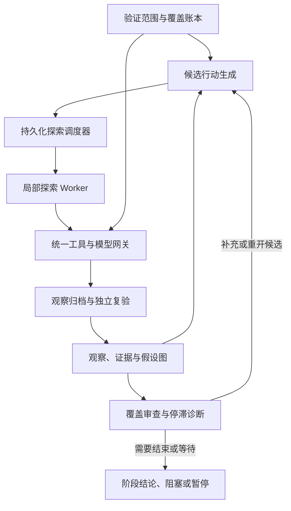

**有。根据你现在明确的目标，我倾向于设计一套“由程序持续调度、以证据和假设保存进度的开放搜索系统”。**

它的核心应当是：**持续保留尚未解决的问题，在不同路径之间分配探索资源，把失败转化为下一步决策，并且允许整个任务跨越很多次 Agent 会话继续运行。**

这里有一个必须落实到架构中的区别：

* **找到一条有效路径**，可以完成某个局部搜索目标。
* **验证系统安全性**，还要检查其他范围、遗漏项与未解决的不确定性，不能在第一次成功后结束。
* 在开放、未知、会变化的系统里，通常无法证明“所有办法都已穷尽”。能交付的是：**在明确范围、条件和资源内，进行了哪些验证，取得什么证据，还剩哪些未知。**

我已经把下面的思路整理成架构提案：。这是设计方案，尚未实现运行引擎。

**一、你的目标应该被翻译成哪些架构要求**

“最大限度探索、不轻易中断”，如果要落实为程序行为，我会这样定义：

| 你的要求          | 对应的系统行为                       |
| ------------- | ----------------------------- |
| 不因一次失败而停止     | 单条路径失败，只更新该路径状态；其他方向继续        |
| 不因模型说“做完了”而停止 | worker 结束不等于项目结束，由外层控制器检查剩余工作 |
| 不因上下文满了而停止    | 归档局部会话，从持久状态重建下一次任务上下文        |
| 不长期困在一条死路     | 识别重复尝试、记录失败条件、调整优先级、切换方向      |
| 不遗漏早期放下的线索    | 保存暂缓原因和重开条件，新证据出现时重新调度        |
| 能不断提出新办法      | 从覆盖缺口、证据冲突、缺失前提和能力不足生成新任务     |
| 不把尝试次数当成果     | 以新增证据、减少不确定性、扩大有效覆盖衡量进展       |
| 不把局部成功当全面验证   | 发现复验与整体覆盖审查分别进行               |

**关键判断是：任务的持续性必须存在于模型之外。**

模型可以暂时不知道下一步，也可以失败、超时、结束会话；全局探索状态应当仍然存在。

---

**二、核心架构：探索循环＋覆盖审查循环**

我建议同时维护两条循环。

**探索循环**负责回答：现在最值得尝试的下一件事是什么。

**覆盖审查循环**负责回答：我们是否一直在容易的区域反复工作；是否遗漏了重要检查项；是否错误地把“没测出来”当成“安全”。

这张图里，最重要的三个控制关系是：

1. **模型产生候选，程序决定是否获准、何时执行。**
2. **worker 产生结果，证据与状态管理决定如何记录。**
3. **worker 可以结束局部任务，只有项目控制器可以结束整个评估。**

多 Agent 可以提高并行度，但它不是这套设计成立的前提。即使只有一个执行 worker，持久状态、分支切换、回访和覆盖审查也应当成立。

---

**三、第一项核心机制：保存“问题及其证据”，而不只是聊天和待办**

只有任务树还不够。任务树经常记录“做过什么”，却没有充分表达：

* 为什么认为这条路值得尝试。
* 当时满足了哪些前提。
* 失败究竟说明什么。
* 条件改变后是否应该重试。
* 哪条观察支持或反对某个判断。

我会把核心状态拆成下面几类：

| 对象        | 保存什么                     | 作用               |
| --------- | ------------------------ | ---------------- |
| **原始观察**  | 工具结果、时间、身份、环境版本、原始产物位置   | 保留可复查的证据         |
| **待验证假设** | 命题、适用条件、支持与反对证据、验证状态     | 让模型判断有明确的证据依托    |
| **候选行动**  | 待查问题、前置条件、预期可观察结果、成本、优先级 | 构成下一步可调度的探索前沿    |
| **尝试记录**  | 实际行动、条件、结果、失败类型、副作用是否确定  | 防止重复与错误恢复        |
| **覆盖项**   | 哪些维度已测、未测、受阻、过时、待复验      | 防止局部成功掩盖全局遗漏     |
| **能力缺口**  | 缺工具、缺知识、缺权限、缺输入及关联任务     | 把“做不了”变成明确的待解决问题 |

这里我会对 Cairn 的 Fact 思路作一个关键调整：

**原始观察、模型推断和已复验结论分别记录。**

工具输出不一定正确，模型把一句话写成 Fact，也不代表它已经成为可靠事实。证据冲突应被保留，不能简单由最后一次写入覆盖。

在开放搜索中，系统往往只能观察到真实状态的一部分。因此，它维护的是**当前对系统的认识及其证据**，不是完整、绝对正确的世界状态。

---

**四、第二项核心机制：维护多种探索方向，避免单一路径占满资源**

如果只按“模型认为最有希望”排序，系统可能一直跟进同一条线索。即使该方向逐渐失去价值，也可能因为已经投入很多而继续投入。

我建议调度器至少维护四类候选：

| 队列         | 主要职责             | 典型触发条件            |
| ---------- | ---------------- | ----------------- |
| **扩大覆盖**   | 检查尚未探索的重要区域      | 覆盖偏斜、存在长期未处理的检查项  |
| **深入线索**   | 沿可靠证据继续推进        | 新观察支持某条路径的前置条件    |
| **证伪与复验**  | 检查发现是否真实，也挑战先前判断 | 高影响发现、证据冲突、结论依据不足 |
| **条件变化回访** | 重开此前暂缓或受阻的方向     | 身份、环境、知识或工具能力发生变化 |

调度时考虑：

* 能增加多少有效覆盖。
* 能减少多少重要不确定性。
* 能否解锁其他分支的前置条件。
* 当前证据质量。
* 预计执行成本与路径长度。
* 是否已经重复尝试。
* 是否长期没有获得执行机会。

**困难不是永久放弃的理由，困难是分配资源的信号。**

一条高价值但很难的路径，可以先保存进度、处理缺失前提，同时让其他路径推进。条件改善后再回来。

近期 PentestGPT v2 的研究也把路径难度估计、证据引导搜索和资源投入失衡作为架构问题讨论。它可以支持这个设计方向，但并不证明本提案已经有效，更不证明开放空间能够被穷尽。[原论文](https://arxiv.org/html/2602.17622v1)

首版原型不需要复杂的最优调度算法。采用**可解释的优先级、分支轮换、连续占用限制和等待时间加权**，就能先验证核心机制。模型自报的“成功概率”应当作为参考，不能直接当成准确概率。

---

**五、第三项核心机制：失败必须有类型、条件和后续处理**

这是“不轻易中断”最关键的一部分。

很多 Agent 把不同失败压成一句“没有成功”，后续处理就只剩“再试一次”或“结束”。

更好的做法是分类：

| 失败类型         | 它实际说明什么           | 下一步                |
| ------------ | ----------------- | ------------------ |
| **工具故障**     | 此次执行没有提供有效观察      | 有限重试、退避或更换获准的等价工具  |
| **缺少前提**     | 当前尚不能检验这个假设       | 建立依赖任务，其他分支继续      |
| **能力不足**     | 缺少知识、工具能力或有效方法    | 记录能力缺口，生成补齐任务      |
| **当前条件下的反证** | 证据不支持该假设在这些条件下成立  | 保存适用条件，降低优先级       |
| **结果不确定**    | 无法确认动作是否生效或观察是否可靠 | 优先核对状态，避免盲目重复      |
| **重复而无新增信息** | 当前尝试方式已经失去价值      | 暂缓该分支，要求新的条件或可检验假设 |

例如，某项检查在未具备适当测试身份时无法完成，应该记录为：

> 当前条件缺少必要身份；相关身份可用后重新打开。

它不应该被记录成：

> 已验证不存在问题。

同样，工具超时也不能作为否定某个安全假设的证据。

**失败应当改变搜索状态，而不是只增加一条日志。**

Reflexion 的研究提供了一个相关思路：把尝试反馈保存下来，让后续决策受到先前失败的影响。我的建议会进一步要求这些反思关联原始观察和适用条件，避免把模型反思自动当成事实。[Reflexion 原论文](https://arxiv.org/abs/2303.11366)

---

**六、第四项核心机制：保存值得回访的探索位置**

开放搜索常见的一种损失是：前面走到一个有价值的位置，后来切换方向或上下文，系统忘了当时为什么有价值，也忘了怎样继续。

因此，每个值得保留的探索位置，应保存：

* 当时的环境、身份与前置条件。
* 已经取得的证据。
* 可复用的产物。
* 尚未解决的问题。
* 已排除的条件组合。
* 重新开始前需要检查什么。

这样，worker 会话可以结束，但这条探索路径不会消失。

Go-Explore 的核心思想之一，就是记住有希望的状态，并先回到这些状态，再继续探索。这与我们的目标有启发关系。[Go-Explore 原论文](https://arxiv.org/abs/2004.12919)

不过，真实系统不能假定可以任意回滚。因此，在这里“回到状态”应当理解为：

> 找回相关证据与工作产物，确认必要条件仍然成立，再继续探索。

不能直接重放全部旧动作，尤其是可能改变外部状态的动作。

---

**七、第五项核心机制：全局持续运行，局部任务可以随时结束**

我会将两种生命周期彻底分开：

| 层级            | 生命周期                     |
| ------------- | ------------------------ |
| **评估项目**      | 可以跨很多次会话、进程重启和阶段性暂停持续存在  |
| **局部 worker** | 执行一个明确问题，允许超时、失败、换上下文和重建 |

一个 worker 应获得有限的“工作包”：

* 当前需要回答的问题。
* 最相关的证据与原始产物索引。
* 已尝试的方法及失败条件。
* 允许使用的工具与动作。
* 本次预算。
* 必须返回的结果结构。

它返回的也不应只有自然语言结论，还应包括：

* 新观察。
* 被支持或反驳的假设。
* 新候选行动。
* 阻塞原因。
* 待复验结论。
* 继续这条路径所需的条件。

随后由控制器决定：继续当前分支、切换分支、派发复验、补齐能力，或进入等待。

**这能把“一个模型会话必须一直坚持”转化为“项目状态持续推进”。** 后者更容易实现，也更容易恢复和检查。

所有角色的工具与模型调用，都应经过相同的执行网关。权限、预算、取消和记录不能只覆盖普通 worker，却遗漏 Planner、验证者或能力补齐任务。

对于崩溃恢复，也要承认一个边界：如果外部动作已发生，而结果尚未写回，仅靠本地日志不能保证恰好执行一次。此时应进入“结果不确定”，优先核对外部状态。

---

**八、第六项核心机制：既防过早结束，也防无限空转**

“不轻易中断”不应等于“无论发生什么都继续调用模型”。

我建议用明确状态代替模糊的“完成／失败”：

| 项目状态       | 含义                         |
| ---------- | -------------------------- |
| **继续探索**   | 仍有获准、可执行、值得投入的候选           |
| **等待**     | 工具或已知依赖正在运行                |
| **受阻**     | 缺少信息、权限、能力或外部条件            |
| **探索平台期**  | 经有限的覆盖审查和候选生成后，暂时没有新的有意义行动 |
| **预算暂停**   | 资源上限已到，保存进度与下一轮候选          |
| **阶段评估完成** | 约定范围和证据要求已满足，给出有界结论        |
| **用户取消**   | 停止派生和执行，不自动恢复              |

尤其要设置两条规则：

**第一，候选为空不立即代表结束。**

先检查：

* 是否还有覆盖缺口。
* 是否有证据冲突。
* 是否把缺前提误判为路径失败。
* 是否有条件变化后应该重开的方向。
* 是否存在可以补齐的能力缺口。

**第二，不能靠反复生成同义候选维持运行。**

重复尝试必须说明：条件、证据或方法发生了什么变化，为什么预期能得到不同观察。

如果这些都没有变化，继续执行只是消耗预算。此时保留状态、报告阻塞或平台期，比假装仍在取得进展更符合你的目标。

---

**九、第七项核心机制：发现复验与整体覆盖分别验收**

这里直接关系到你说的“完成对系统安全性的验证”。

我会分别设置：

**发现复验：** 某个具体结论是否有足够证据。

复验者需要看到原始证据和适用条件，并通过可重复检查、交叉证据或任务专用判定进行复核。多个模型对同一份摘要投票，不能替代这一步。

**覆盖审查：** 整个项目是否还有重要遗漏。

覆盖账本可以按资产、入口、授权身份、业务状态、信任边界和检查类别组织，但不应机械展开所有组合。新对象出现时，账本也应扩展。

因此，一次有效发现可能产生两个结果：

* 该假设获得确认。
* 由于发现了新的关系或状态，反而开启更多待验证项。

最终报告应当清楚区分：

> 已验证内容、已确认发现、未发现问题的适用条件、未测试内容、受阻内容、证据已过时内容，以及剩余不确定性。

这比一个总的“安全／不安全”标签更接近系统实际完成的工作。

---

**十、从前面五套架构中，我会怎样取舍**

| 来源                | 借鉴的机制                   | 为当前目标需要补充或改变的地方             |
| ----------------- | ----------------------- | --------------------------- |
| **Cairn**         | 事实／意图图、程序持续调度           | 区分观察与假设；增加覆盖账本、失败分类、回访条件    |
| **ARTEX**         | 事件驱动规划、持久意图、worker 会话恢复 | 关键规划状态完整持久化，统一各角色的权限和预算     |
| **aiscan**        | 工具循环、事件、后台执行、子任务接口      | 项目生命周期独立于单次循环；父子控制契约一致      |
| **CyberStrikeAI** | 异步执行 ID、等待／取消、项目事实和工具治理 | 完成状态与业务复验分开；所有调用纳入统一控制      |
| **cain-agent**    | 结构化产物、发现与验证分离           | 固定阶段用于局部验证协议；全局仍允许分叉、回访和重规划 |

**我的架构选择会以 Cairn／ARTEX 的持续探索思路为主干，把执行治理、证据复验和覆盖审查做成明确的程序机制。**

我不建议首版就堆很多专业 Agent。先证明一个 worker 能够持续切换分支、保留进度、识别重复和正确恢复，再增加并行度，才能知道多 Agent 究竟带来了什么收益。

---

**下一步原型应该证明什么**

现在可以把原型的核心命题明确下来：

> **在开放、部分可观察的任务中，持久状态与调度机制，能否减少过早结束和无效重复，并让探索在局部失败后继续推进。**

实现顺序建议固定为：

1. **状态底座**：SQLite 保存假设、候选、尝试、覆盖项与事件；原始证据存文件。
2. **单 worker 搜索循环**：实现四类候选队列、失败分类、暂缓与条件变化重开。
3. **复验和覆盖审查**：发现有原证据，局部成功不会直接关闭整个项目。
4. **中断与预算控制**：验证进程重启、结果不确定、用户取消和预算暂停。
5. **再加入第二个 worker**：检查并行认领、共享状态冲突与全局预算。

完全可以先使用人工构造的隐藏状态环境，而不接真实系统。环境中放入循环死路、缺前提分支、假阳性诱饵、暂态工具故障和版本变化，再与相同预算的简单 ReAct 循环比较：

* 到达了多少有意义状态。
* 完成了多少有证据支持的检查项。
* 重复尝试比例。
* 过早结束次数。
* 中断后的进度损失。
* 总调用量与时间。

**我的明确判断是：这个方向值得做，而且能形成结构清楚的原型。最有价值的突破点，是让探索机会被持续保存和重新调度，让局部失败不再轻易变成全局结束。**
