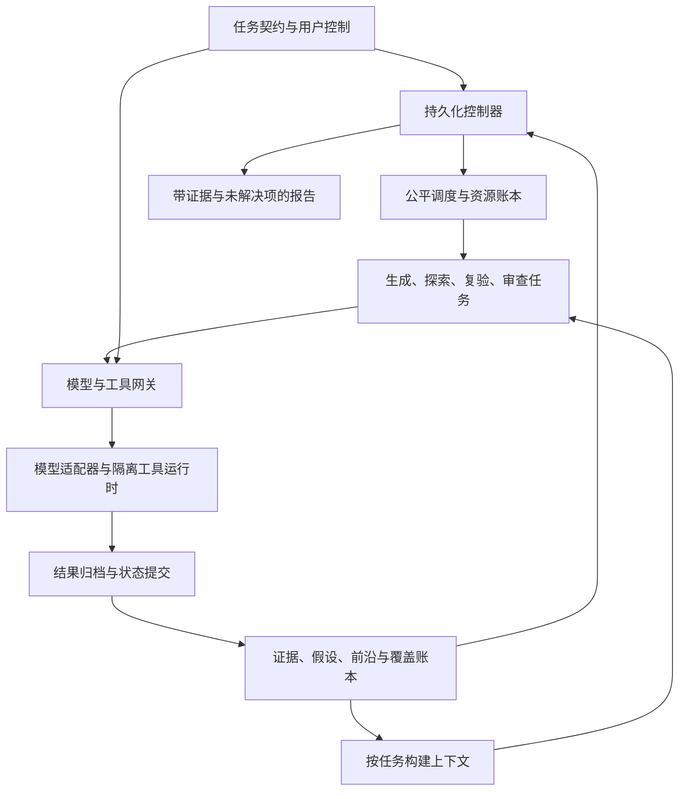

**开放搜索型安全验证 Agent：详细架构 v0.2**

设计日期：2026-09-01。本文扩展同会话 v0.1，面向 RioNext 的架构推演和原型实现。下述接口、参数和行为均为拟议设计；没有实现或运行一个安全验证引擎，也没有据此证明真实任务完成率。已有五个项目仅提供可借鉴的机制，版本与依据列于文末。

**核心决定。** 采用“持久化探索调度器＋证据与假设图＋候选行动前沿＋覆盖账本＋短生命周期 worker＋独立复验”的模块化单体。程序持有任务生命周期、权限、预算、状态提交和结束权；模型提出问题、构造局部实验、解释观察并建议下一步。先用单探索 worker 验证核心协议，再加第二个 worker 检查并发语义。

架构优化的是：在既定资源与授权范围内，让重要问题得到更多有区分力的检查，让已取得的进展能够继续利用，让困难方向可以暂缓和回访。持续运行时长、候选数量和工具调用数量不直接代表验证质量。

**01｜问题定义与可承诺的边界**

开放搜索中，系统看不到完整环境状态，也不知道所有可能行动。一次观察可能改变假设、环境状态或下一步可行动作。设真实状态为 x，系统保存的观察与条件集合为 K，可执行候选为 F，覆盖义务为 C，资源余额为 B；控制器实际在 (K,F,C,B) 上工作，不能宣称它持有完整 x。

初始目标是 security_assessment：持续形成关于指定范围的证据化评估。find_one_path 只能作为局部子目标；完成一条路径不默认结束整个 Campaign。若以后支持持续监测，应另设连续评估模式，按环境版本形成评估批次，不能把某次评估完成等同永久安全。

|可以设计成可检查的性质|成立条件与边界|
|---|---|
|worker 自报结束不直接结束项目|Campaign 只能由控制器状态转换关闭|
|已提交的观察和候选可在会话结束后恢复|持久存储可用，产物完整，状态迁移版本可读|
|取消后不再接受新的执行提交|以网关提交点为边界；已经发往外部的动作仍可能完成|
|预算不足时拒绝新的可计价调用|所有调用经过网关，适配器提供保守上界；未知收费保留负债，不能保证外部账单绝对精确|
|获准且持续可执行的分支有调度机会|预算、执行容量充足，单次执行有界，候选进入机制受到限流；不保证有限预算内服务无限候选|
|未确认的外部执行不被盲目重发|适配器必须说明幂等和核对能力；不声称任意外部系统 exactly-once|
|结论可追溯到证据及适用条件|引用完整性可以程序检查；证据语义仍需要检查协议或复验|

不能由这份架构推出：找到所有未知漏洞、穷尽无限状态空间、LLM 一定生成关键假设、多个模型投票必然正确、模拟环境上的提升一定迁移到真实系统。这些边界直接决定状态名和输出契约，不作为附带声明处理。

**02｜架构拓扑与部署边界**

以下均为逻辑模块，不要求分别部署。第一版一个控制进程、一个本地数据库、一个产物目录，以及受控 worker/工具子进程即可。



|模块|输入与输出|谁拥有决定权|主要取舍|
|---|---|---|---|
|任务契约服务|目标、范围、身份、预算、结束标准 → 版本化 CampaignSpec|用户配置，程序验证|启动需要结构化边界；自然语言可先解析为草案|
|持久化控制器|事件与账本 → 状态迁移、调度请求、报告快照|程序|可靠性依赖显式状态机，增加工程代码|
|候选生成器|覆盖缺口、证据、反例、能力缺口 → FrontierProposal|模型与规则提出，程序接纳|生成盲区仍可能存在，必须保留不同提问来源|
|调度器|合格候选、资源、队列债务 → 任务租约|程序，模型只提供估计|可解释但并非全局最优|
|上下文构建器|任务、相关关系与版本 → ContextBundle|程序决定必带约束，检索辅助选证据|减少全图输入，存在漏召回，需要来源清单|
|worker runner|ContextBundle、TaskLease → 行动请求、局部结果|模型控制局部动作，程序限制执行|可替换模型，但不能让 SDK 私下绕过调用网关|
|执行网关|标准调用请求 → 准入、执行 ID、结果|程序|集中控制便于审计；通用 Shell 不能只靠字符串规则获得同等保证|
|提交与知识服务|原始输出、主张增量 → 观察、边、候选、覆盖变更|程序保证一致性；领域适配器和复验决定结论等级|关系模型有维护成本，防止把任意模型文本升级为事实|
|复验与覆盖审查|主张和原始证据、覆盖快照 → VerificationResult、缺口|程序检查结构；独立任务检查语义|占用预算，但减少误报和过早收尾|
|恢复与资源服务|租约、执行记录、预算负债 → 核对/回收/阻塞|程序|宁可保留结果不明，也不假装已安全恢复|

状态写入统一由提交服务执行，worker 没有数据库任意写权限。多进程未来可以使用同一协议；原型不先引入消息集群、图数据库或分布式领导选举。

**03｜必须始终成立的系统不变量**

1. Every action has an owner：每个模型、检索和工具请求都关联 campaign_id、task_id、attempt_id、权限版本和预算预留。
2. No proposal is authority：候选、模型输出、网页内容、MCP 返回值都不能扩大授权或提高预算。
3. Evidence precedes conclusions：结论必须引用已提交、可读取的证据；哈希只能证明内容一致性，不能证明内容真实。
4. Durable progress outlives workers：会话、上下文摘要、worker 进程均可丢弃，已提交项目进度必须保留。
5. Fencing before execution：过期租约的 worker 不能提交新动作；迟到结果保留来源并隔离审查，不能覆盖新版本判断。
6. Uncertainty survives crashes：外部效果不明是一种持久状态，不自动解释成失败或可重试。
7. Coverage is versioned：已测、未测、受阻、过时、豁免分别保存；修改分母必须有版本与原因。
8. Cancellation dominates exploration：用户取消或撤销授权优先于重规划、重试、子任务和定时唤醒。
9. Local limits are subordinate：子任务、摘要、验证、模型切换和能力补齐不能重置项目总账。
10. Completion is a checked transition：模型只能建议结束，程序按照冻结的检查标准作出状态转换。

这些是协议目标，后面的故障测试逐条对应；没有运行测试前不能把目标写成已经获得的保证。

**04｜数据模型：用关系表表达图，而不是把整段聊天叫记忆**

各表至少带 id、campaign_id、created_at、schema_version。可修改实体另带 revision；关系和观察追加记录，撤销通过新版本表达。默认所有查询按 campaign_id 和数据可见性过滤。

|对象|关键字段|修改规则|
|---|---|---|
|Campaign|goal_type、scope_ref/version、policy_version、coverage_version、run_epoch、status、stop_reason、budget_ref、completion_policy|只有控制器接受用户命令后迁移；结束附 report_snapshot_id|
|Entity|type、canonical_key、aliases、discovered_by、resource_versions、visibility|实体合并保留别名与依据；相似名称不能直接合并|
|Observation|attempt_id、artifact_refs、tool_version、subject、identity_ref、conditions、observed_at、resource_versions、parser_version、validity|记录“在某条件下观察到什么”；来源不可追溯时质量降级|
|Hypothesis|claim、condition_predicates、support_refs、refute_refs、status、verification_refs、revisit_triggers|状态含 proposed/supported/contested/verified/refuted_under_conditions/stale；反证不扩张为全局否定|
|Relation|from/to、type、condition、source_refs、revision|关系支持 supports/contradicts/requires/unlocks/invalidates/tests/derived_from|
|FrontierItem|question、strategy_family、queue、expected_observations、preconditions、hypothesis_refs、coverage_refs、resource_keys、cost_band、status、retry/revisit_policy|候选进入准入检查后才成为 ready；执行成功不自动代表命题成立|
|TaskRun|frontier_id、role、worker_id、lease_epoch、lease_until、base_revision、context_manifest、budget_envelope、checkpoint_ref|任务是有界执行片段；同一候选可有多个串行或受控并行片段|
|Attempt|task_id、invocation_key、action_fingerprint、policy_version、run_epoch、lease_epoch、status、execution_id、effect_state、reservation_ref、result_refs|记录模型与工具调用；每次外部重发是新的可计费尝试并关联上次|
|Verification|claim_revision、evidence_refs、method/version、independence_dimensions、result、limitations、verifier_task_id|结果可为 confirmed/rejected/inconclusive/needs_retest；不能只保存通过/失败|
|CoverageItem|subject、identity_class、state_class、boundary、check_family、applicability、test_status、finding_status、evidence_refs、requirement_version|适用性、是否已测、是否发现问题是不同字段|
|CapabilityGap|missing_type、required_for、allowed_resolution、status、failure_reason|补齐失败可以阻塞局部方向；模型不能把缺授权改写为缺工具|
|BudgetReservation/Ledger|root_budget_id、task_id、dimension、reserved、settled、unknown_liability、state|原子预留；结算以唯一调用 ID 去重；未知费用保持占用|
|ResourceLease|resource_key、mode、owner、epoch、expiry、experiment_id|针对可能相互污染的实验、身份或会话加锁；到期不代表外部操作已经停止|
|MemoryEntry|scope、kind、content、evidence_refs、validity、confidence_label、supersedes、expiry、deleted_at|默认项目内；跨项目提升单独配置并审查|
|Event/Outbox|event_id、type、aggregate_revision、causation_id、correlation_id、payload、delivery_status|业务写入与 outbox 同事务；消费者按 event_id 去重|
|Artifact|content_hash、storage_ref、media_type、byte_size、producer、visibility、retention、redacted_view_ref|原件与脱敏视图区分；内容不可变，引用与访问控制可变|

不维护一个虚构的全局“真实环境版本”。受控模拟环境可提供精确版本；真实适配器最多提供资源指纹、观察时间和本地观察代次。无法确认的条件标 unknown，关键动作前主动复查。证据依赖于哪些资源，就主要失效这些资源相关的结论。

**候选样例。** 以下在合成环境中检查“指定身份对某类对象的可见性是否符合定义”，没有面向真实目标的操作步骤。

```json
{
  "frontier_id": "f-018",
  "question": "当前测试身份对样本对象的可见性是否符合访问规则？",
  "queue": "coverage",
  "strategy_family": "paired_observation",
  "hypothesis_refs": ["h-007"],
  "coverage_refs": ["c-011"],
  "preconditions": {
    "all_of": [
      {"predicate": "test_identity_available", "ref": "identity-B"},
      {"predicate": "sample_exists", "ref": "object-class-3"}
    ]
  },
  "expected_observations": [
    {"label": "rule_consistent", "effect": "add_conditional_counterevidence"},
    {"label": "rule_inconsistent", "effect": "request_independent_verification"},
    {"label": "ambiguous", "effect": "record_inconclusive_and_refine_question"}
  ],
  "resource_keys": ["sim-session-B", "sim-object-class-3"],
  "cost_band": {"model_calls": [1, 3], "tool_calls": [1, 4]},
  "revisit_on": ["identity_available", "sample_version_changed"],
  "status": "blocked"
}
```

支持 AND/OR 条件：一个实验可能需要两个前置条件同时成立，而获得某个条件可能有多种允许路径。可以共享一个前置任务供多个候选依赖。依赖图出现循环且没有外部可获得入口时，标 dependency_cycle，要求改写问题或补充外部条件，不能无限递归生成父子任务。

**05｜候选从哪里来：开放性主要在这一层**

调度器不能探索从未生成的方向。候选生成采用互补来源，输出统一 FrontierProposal，不把一个全能 Planner 当作唯一问题来源。

|生成来源|固定要回答的问题|产生的候选|
|---|---|---|
|覆盖规则|已发现对象中，哪些规定的检查仍无证据？|已知范围的缺口检查|
|证据延伸|这条新观察还支持哪些可检验解释？|线索深入、邻接对象探索|
|反例与矛盾|现有结论在什么条件下可能失效？|证伪、复验、条件对照|
|前置条件分析|哪一个缺失条件阻止了多个方向？|依赖获取、能力缺口任务|
|类别与关系差异|两个看似相同的对象为何表现不同？|差异解释、边界检查|
|外部知识与历史方法|本地当前假设遗漏了哪些已有方法？|带来源、适用条件和权限要求的新方法候选|
|盲区审查|哪个重要维度一直没有候选、哪些类别被过早排除？|覆盖模型修订提案、替代假设|

生成器必须写 question、discriminating_observation、why_new、preconditions 和 stop/revisit_condition。程序拒绝缺字段、引用不存在、完全相同候选和已明确越界的建议；语义近似只标记 possible_duplicate，由后续判定保留差异。

新颖性来源分为：新对象、新条件、新关系、新方法族、新反证。换一种措辞、换一个角色名、同样输入重问一个模型通常不能算新方向。将候选过度拆成很多小项，也不能获得更多服务配额；配额记在稳定的分支/问题族上。

为了避免只做清单内的事，覆盖目录保留“未建模现象”和“新对象/关系发现”入口。新类别先提出，再由程序记录为未审定分类；不能由模型静默删除旧义务或改变结束阈值。重要新对象产生待分诊义务，不能被当作未定义而忽略。

每次生成设置候选数量和模型调用上限；优先因新证据、条件改变、覆盖缺口触发。没有变化时不每隔几秒让 Planner 重写计划。队列有上限，低优先候选进入持久归档并保留类别索引，不能因内存压力无记录丢失。

生成/审查任务使用唯一键 (campaign_id, purpose, progress_revision, bounded_round)，source_event_id 只作为来源元数据。程序控制 bounded_round，普通生成每代最多一轮，盲区审查每代最多两轮；同一 purpose/progress_revision 同时至多一个排队或运行任务，重试次数也持久化。progress_revision 仅在程序接纳了新的可区分观察、有效前置条件、证据等级变化、覆盖结果或矛盾变化时增加；候选措辞、时间戳、摘要、反思、租约心跳和审查报告本身不增加它。提出新假设本身不清零停滞计数。归档候选按持续可执行时间和类别轮换定期重新纳入活跃集，计数不因归档/重新入队而重置。

**06｜调度算法：先准入，再公平分配，再局部排序**

建议使用四个业务队列和一个受限的控制任务类别。控制任务包括候选生成、上下文压缩、覆盖审查和报告，不免费，也不能无限抢占业务任务。

|队列|首版服务份额示例|目的|
|---|---:|---|
|coverage|35%|给未覆盖区域持续机会|
|deepen|30%|利用已有证据探索有价值的深入路径|
|verify|25%|确认发现、检查反例和证据冲突|
|revisit|10%|在条件变化后回到历史受阻分支|

这些百分比是待调参的初始策略，不是研究结论；按归一化资源量计服务，而非单纯任务个数。没有合格任务的份额可借给其他队列，产生的服务债务有上限。最紧迫的资源维度采用主导占用量近似；单次长操作不可抢占时，公平性只能在调用边界体现。

**第一步：准入过滤。** 候选只有在授权有效、前置条件成立、证据未失效、资源可取得、预算足够、未取消且去重允许时才进入 eligible。等待时间和高评分不能覆盖这些条件。关键前提为 unknown 时先执行检查前提的任务。

**第二步：队列与分支公平。** 按服务欠额选择队列，在队列内防止单一分支连续占用全部片段。为有足够理由但代价较高的候选积累专用资源额度；否则低成本优先会永久排除困难分支。积累额度也来自同一个总预算。有限预算无法保证所有困难分支均执行，必须显示未获服务项。

具体起步规则：分支键由程序依据对象与问题族分配，模型不能任意创建新配额身份；每个有合格任务的业务队列，在不超过 10 个业务片段的调度轮内至少获得一个选择机会。队列内部每累计 4 次常规派发，第 5 次选择持续合格且最久未服务的分支，然后在该分支内选择最老的合格候选。暂不够单次成本的分支积累信用，信用与预留均有上限。硬授权/资源门槛仍优先；这提供明确的防饥饿机制，不能保证不受控无限新流量下的统一最大等待时长。归档区最老合格项参与这次公平选择，不能永久藏在活跃队列之外。

**第三步：局部优先级。** 首版采用可解释等级组合：必做覆盖缺口或已确认重大冲突优先；随后看预期区分力、解锁依赖数量与重要性、证据质量、方法族差异、等待程度，再惩罚重复与成本。LLM 对“信息增益”的描述是启发式标签，未校准为概率或熵。

每次 DecisionRecord 保存候选集合摘要、入选项、未选原因、评分组成、资源快照、策略版本。若使用随机打破同分，保存随机种子。难度只改变分配方式，不直接变成永久否定证据。

```python
def controller_tick(event):
    # 以下为协议伪代码，不是可运行实现。
    apply_event_idempotently(event)
    enforce_campaign_control()             # 取消/授权版本优先
    ingest_already_received_results_and_settle_cost()  # 本地提交，不发新调用

    if campaign_is_cancelled():
        request_stop_of_existing_executions_only()
        persist_partial_report_snapshot()
        return

    if campaign_is_user_or_budget_paused():
        apply_configured_drain_or_stop_policy()
        persist_partial_report_snapshot()
        return

    enqueue_bounded_reconciliation_if_needed()  # 主动查询也是网关内的计费任务
    invalidate_dependent_evidence_if_needed()
    wake_candidates_from_dependency_events()

    if needs_generation_or_audit() and control_budget_available():
        enqueue_bounded_control_task()

    eligible = eligible_frontier_and_control_tasks()
    if eligible:
        item = fair_queue_then_branch_then_priority(eligible)
        # 一个短事务：重新检查版本与余额，认领、取得资源、分配额度。
        lease = atomic_claim(item)
        dispatch_if_still_current(lease)
    elif has_inflight_or_scheduled_dependencies():
        set_waiting_with_next_event_or_deadline()
    else:
        evaluate_versioned_completion_or_blocking_reason()
```

定时器与事件均落库。waiting 使用事件订阅与到期时间，不通过模型轮询保持活跃。定时器重复投递不会重复执行动作；消费者事件去重与动作准入分别负责不同层次。

**07｜worker 协议与上下文管理**

逻辑任务分 generator、explorer、verifier、auditor 四种，可由同一模型在不同任务会话执行；它们不要求四个永久人格。worker 在本地使用有界 ReAct，也可以调用获准的确定性检查 Skill。

TaskLease 必须包含：campaign/task/frontier ID、lease_epoch、run_epoch、scope/policy 版本、上下文版本、预算子额度、允许工具、禁止副作用类别、checkpoint 要求、截止时间和返回 schema。worker 不能自行创建独立预算子树；委派只能提交子任务提案给控制器。

ContextBundle 分为六部分，优先级明确：

|部分|内容|超长处理|
|---|---|---|
|硬约束|范围、身份、权限摘要、取消代次、预算、任务返回协议|必带；放不下则拒绝该模型配置，不能裁剪|
|当前问题|命题、预期可判别观察、前置条件、局部结束条件|必带|
|直接证据|支持、反证、冲突、关键原文定位、证据有效期|优先保留双边证据；长度超限使用可取回引用|
|历史失败|相同条件下尝试过什么、为什么无效、重开条件|结构化优先，防止摘要吞掉否定条件|
|相关世界状态|邻接实体、相关覆盖缺口、依赖进展、近期变化|按需加载，记录选取原因|
|方法与外部材料|适用 Skills、工具索引、研究来源、项目经验|按需展开；均带可信级别，不升级为控制指令|

先查明确 ID 与关系，再进行词法检索；可选向量召回用于描述差异大的知识。权限过滤在召回前或检索执行层完成，不能先把不可见内容塞入模型再让模型忽略。原始工具输出留产物目录，大输出返回摘要、大小、截断标记、内容哈希和可读取区间。

每次模型调用保存 ContextManifest：规则版本、证据 ID、摘要版本、工具 schema 哈希、裁剪策略、模型配置、来源访问判定。保存足够还原输入的材料和决策理由，不要求记录或公开模型私有思维过程。摘要是 derived artifact，带来源列表；事实和反思不能因摘要合并而混为一体。

局部执行片段结束时返回 WorkerResult：observations、hypothesis_updates（均为提案）、new_frontier、failure_class、unresolved_questions、checkpoint_refs、next_trigger、local_completion_reason。网关持续记录已执行调用，不能等 worker 最后总结时才保留所有进度。

worker 输出解析失败时允许一次有预算的格式修复；仍失败只保留已归档观察，任务进入 worker_protocol_error。不能把无效 JSON 当作阶段完成。

**08｜工具、模型与外部知识的统一准入**

GatewayRequest 包含 invocation_key、task lease、adapter/tool ID 与版本、arguments、resource_refs、expected_effect、timeout、cost_reservation。适配器 manifest 由受信配置提供 effect_class、可见资源解析器、成本上界、幂等能力和结果判定方式；模型不能自报“只读”就获得只读权限。

|调用阶段|程序检查|失败后的行为|
|---|---|---|
|解析|schema、适配器版本、参数、资源引用|返回可定位的契约错误|
|授权|当前 scope/policy、身份、工具、数据出口、有效批准票据|拒绝或进入 awaiting_input；其他合法任务继续|
|一致性|run_epoch、lease_epoch、关键前提版本、资源冲突|拒绝过期提交，要求重建上下文或重新领取|
|预算|根预算余额、任务子额度、费用预留、并发与速率|预算暂停或等待资源，不能隐式追加余额|
|执行|生成持久 execution_id、发出调用、跟踪心跳/超时/取消|归档状态；不明外部结果进入 uncertain|
|归档|原始产物、摘要、退出状态、观测条件、用量|提交观察提案；不把退出码直接当业务成功|

授权缓存和预算缓存不能让撤销后继续发动作。最终准入与 dispatch 在网关形成明确提交点；在该点之前取消应阻止发出，在该点之后只能尽力取消并追踪结果。

原型只接合成环境适配器、文件证据读取和可配置模型适配器。以后若接通用 Shell，要使用独立文件系统、受控出口、受限凭据和进程资源限制；仅有 cwd、容器名称或命令正则不能提供等价边界。所有子进程凭据由运行时分配，worker 不能获得绕过网关的模型 API 凭据。

网络适配器应在解析目标、重定向和实际连接处检查允许范围，并记录最终目标。外部 MCP 是调用协议，不天然是权限隔离；远端服务的副作用分类、鉴权和可取消能力仍需适配器声明与程序约束。不能因远端声明了 annotations 就信任其安全属性。

检索结果保留 source_uri、fetched_at、版本或发布时间（若可知）、content_hash、许可见范围和适用条件。新方法可生成候选；要变成新工具，必须通过工具注册与测试流程。默认允许自动编写的代码只在隔离的合成环境中验证，不自动加载进控制进程，也不修改策略。

**09｜持久执行、检查点与崩溃恢复**

恢复分三层：项目逻辑状态恢复、worker 上下文重建、外部执行状态核对。前两层成功不代表第三层已经确定。

SQLite 事务可用于状态、预算预留和 outbox 的本地原子更新；外部模型服务、工具效果和独立产物文件并不会自动加入该事务。[SQLite 原子提交说明](https://sqlite.org/atomiccommit.html) 因此原型采用以下顺序。

原型数据库放本地磁盘，显式启用外键；采用 WAL 时校验实际启用结果，使用满足持久性目标的 synchronous 设置并管理 checkpoint。WAL 允许读写并行但仍只有一个写者，不能把它放到共享网络文件系统来获得多机数据库。[SQLite WAL 说明](https://sqlite.org/wal.html) 断电持久性以文件系统与同步语义正常工作为前提。

1. 在短事务内认领 TaskRun、增加 lease_epoch、分配任务子额度、写事件。不要在数据库事务中等待模型或网络。
2. 网关持久保存 prepared Attempt 与单次费用预留，再以相同 invocation_key 检查重入。
3. 调用前再次检查代次、取消、权限和关键资源条件；登记 dispatch 提交点与 execution_id。
4. 工具运行时将输出写入临时产物，完成后校验大小/哈希、同步并原子改名；再在数据库事务内引用已存在的产物、写结果、结算用量、添加 outbox。
5. 若产物已完成但数据库提交失败，启动恢复通过产物 manifest 和 attempt_id 寻找可接回结果；无法接回的孤立产物按保留策略回收。若数据库引用失效，证据标 unavailable，不让报告声称可复现。
6. 进程重启后先枚举未终结 Attempt、租约和账本，再开放新动作。租约过期只代表执行权可重新分配，不代表旧的外部动作未发生。

|崩溃位置|恢复行为|
|---|---|
|prepared，未达到 dispatch 提交点|可安全重新准入或释放预留，保持 invocation_key 幂等|
|dispatch 后无外部执行确认|若适配器支持幂等提交，可用同一键查询/恢复；否则标 uncertain，不盲发|
|execution_id 已知，工具可能仍运行|查询或重新挂接；按状态决定等待、取消或归档|
|工具执行完成，结果尚未进入数据库|从运行时/产物 manifest 核对；副作用未知时保持 uncertain|
|数据库提交完成，事件未投递|outbox 重投，消费者 event_id 去重|
|旧 worker 在租约过期后回来|拒绝其新动作；迟到观察保留原来源，经版本检查后可作为历史证据|

对于无幂等、无可核对状态的动作，协议最多能保留一次已发出的记录并避免自动重复，不能凭空恢复结果。只读检查也可能收费或触发副作用，因此重试资格以适配器 manifest 和作用域政策为准。

资源锁需要保持到已发出的冲突动作确认结束，或资源被标为不可用。不能仅因 worker 租约失效就让另一个 worker 修改相同资源。fencing token 只能阻止支持检查该 token 的后续入口，不能撤回已在外部进行的操作。

一次实验涉及多个资源时，按固定资源键顺序全有或全无地取得执行所需锁；不能拿着部分锁等待另一个任务释放剩余锁。等待依赖/预算的任务释放没有在途效果的锁；无法释放的资源显示具体占用者和核对状态。

**10｜多 worker 协作与冲突处理**

共享已提交的证据、假设、候选和覆盖状态；每个任务保持独立 ContextBundle、临时工作目录、模型会话和预算子额度。子 worker 不能直接继承父 worker 的任意 shell 环境或扩大工具集合。

|冲突|处理|
|---|---|
|两人提出同一个候选|精确规范化键去重；保留两个来源；语义近似标记待比较|
|两人更新同一假设|带 base_revision 提交，过期更新转成可合并提案；矛盾证据同时存在|
|两个实验会改变同一身份、会话或样本|按 resource_key 串行，或由适配器提供独立副本；副本能力不可假设|
|一个 worker 发现环境变化|相关证据失效事件触发其他任务在下一网关边界重新检查|
|父任务取消|递增取消代次；子任务、后台工具、模型请求同步收到取消|
|父任务结束但子任务仍运行|父任务进入 waiting_children 或显式转移归属；不能变成无主后台执行|
|worker 失联|保存已归档进度；核对在途动作；释放可安全释放的资源后再派|

候选生成和证据读取可以大量并行；改变共享环境的实验要更谨慎。并发数量应由资源类型、速率限制、验证积压和可用预算共同约束，不能因为还有模型线程就增加 worker。

复验独立性分维度记录：不同会话、原证据访问、不同观察方法、不同工具、不同模型或不同测试样本。仅增加相同模型的投票次数，不自动提高到更强的验证等级。

**11｜失败分类、停滞与条件回访**

|FailureClass|含义|下一状态与动作|
|---|---|---|
|transient_tool_error|网络、限流、暂时不可用|适配器允许时有限退避；默认初次加两次重试，仍失败 blocked|
|invalid_observation|数据不完整、解析错误、条件不成立|修复观察方法；不能修改业务结论|
|missing_precondition|身份、样本或依赖未具备|blocked＋依赖候选；等待对应事件|
|capability_gap|缺少获准工具、知识或执行能力|创建有预算的补齐任务，不能自动提升权限|
|conditional_counterevidence|在当前条件下观察支持否定|保存条件化反证，关闭或细化局部假设|
|inconclusive|结果同时支持多种解释或质量不足|提出更有区分力的检查；无检查则 deferred|
|effect_uncertain|调用可能产生了外部效果，但不能确认|核对；冲突资源隔离；不按普通错误重试|
|no_progress_repeat|同条件、同方法持续得到相同信息|抑制重复、降低优先级、保存重开条件|
|policy_denied|当前动作不获准|保留明确原因；不能换工具绕过同一限制|
|worker_protocol_error|输出不符合返回契约|有界格式修复；保留已归档观察，不能标完成|

动作指纹至少包括工具及版本、规范化参数、对象、身份、前置条件指纹和资源观测版本。请求幂等键用于“同一次提交”，语义动作指纹用于“这些尝试是否实质重复”，两者不可混用。确有暂态问题或独立复验需要时可重复，但须带 repeat_reason 和独立费用记录。

候选暂缓后归档一个 ExplorationCheckpoint：可用证据、依赖条件、未解决问题、执行过的条件组合、可复用产物、如何确认当前条件仍成立。回访先复查条件，再执行新实验，不自动重放历史命令。

Go-Explore 提出记住有希望的状态并先回到这些状态再探索；本设计借鉴归档与回访原则，不能照搬可重置游戏环境的假设。[Go-Explore 原论文](https://arxiv.org/abs/2004.12919) Reflexion 用反馈形成跨尝试的反思记忆；本设计把反思保存为待验证经验，与原观察分开。[Reflexion 原论文](https://arxiv.org/abs/2303.11366)

有效进展采用类型化指标：新增可区分状态、获得前置条件、提高证据等级、覆盖此前未测义务、发现或消解矛盾。新增文本字数、重复证据条数、任务拆分数量不计。难分支可能在较长片段内才有结果，因此同时记录里程碑和上界，避免短窗口错误淘汰。

一个初始停滞规则可设为：连续 8 个任务片段没有有效变化，触发一次盲区/方法审查；相同知识版本下最多两轮审查，每轮最多 6 个候选，最多 1 次生成模型调用。没有新材料时不重置审查计数。仍无可执行方向则 plateau。参数都是原型默认值，须对不同长路径场景做敏感性分析。

**12｜覆盖、证据等级与独立复验**

覆盖对象是验证义务，而非“已跑工具数”。义务可由资产、入口、身份类别、业务状态、信任边界与检查类别组合；只生成确有适用依据的组合，避免无意义的全笛卡尔积。

CoverageItem 的 test_status 可取 untested/in_progress/tested/inconclusive/blocked/stale/waived，finding_status 另取 none_observed/suspected/confirmed/refuted。tested＋none_observed 只表示特定方法和条件下未观察到问题；blocked 不计已测，waived 必须有授权来源且单列。

证据等级拟定如下，用于治理而非通用科学标尺：

|等级|最低要求|可用于什么|
|---|---|---|
|E0|只有模型主张或经验类比|生成候选，不能作为确认结论|
|E1|存在可读取原始观察与条件|记录线索和条件性观察|
|E2|通过版本化领域判定器，或独立方法得到一致可判别证据|在规定条件下确认检查结果|
|E3|按任务政策要求完成独立复现/交叉验证，并处理关键反证|高影响主张的确认，仍不等于全域证明|

同一份证据反复摘要、换模型投票不会自动从 E1 升级到 E2。工具退出 0、报告 JSON 合法、存在某个 evidence_id 都只通过结构或执行检查。

复验任务拿到命题、条件、原证据与反证，不以探索者叙事作为唯一输入；可先独立给出预期判据再读探索结论，减少确认偏差。若只有不能重放的单次事件，则验证完整性和交叉证据，并把不可复现性写入限制，不伪造第二次实验。

确定性判定器由领域适配器提供，例如合成世界的可观察行为是否满足指定规则；测试框架的隐藏真值不暴露给 agent 判定器。真实领域如果没有可靠判定器，应保留 inconclusive 或由具备独立证据的复验提升，不能拿另一个 LLM 的确信替代。

覆盖报告至少给出分母版本、必做项数量、已测项、确认发现、未确认、受阻、过时和豁免。不只显示一个百分比。新增对象时保留旧快照并增加分母，不能静默修改历史进度；模型也不能通过减少分母达标。

**13｜生命周期与完成闸门**

用户控制命令分 hint、pause、resume、cancel、amend_scope、amend_budget、accept_exclusion。Hint 改变优先级或补充信息，不直接扩大授权。Pause 可选 graceful（阻止新动作，让可控在途动作归档）或 immediate（尽力取消在途）；Cancel 终止当前运行代次，普通唤醒事件不能恢复。

取消后的唯一主动运行时操作是对已存在 execution_id 发出停止请求；默认禁止新增探索、模型总结、重试和主动外部查询。被动接收的迟到结果仍可本地归档。主动核对若会产生新请求或费用，须在任务契约中有明确的后续核对授权，否则停留在 unresolved；不会为追求“干净结束”擅自恢复执行。

|Campaign 状态|进入条件|允许的后续|
|---|---|---|
|running|有可调度任务且控制条件允许|持续执行|
|waiting|已有在途动作或有明确到期/依赖事件|事件到达后恢复调度|
|awaiting_input|存在必须由用户决定的具体缺口|其他获准分支可继续；界面报告输入请求|
|blocked|没有可执行任务，重要义务被缺能力/条件阻塞|条件改变并通过准入后恢复|
|plateau|有界审查无新行动，仍未满足完整评估标准|新证据或用户改变策略后可再开|
|budget_paused|任一硬资源维度不能满足继续要求|调整预算或降低任务范围后恢复，均留版本|
|user_paused|用户暂停|显式 resume|
|closing|程序开始构建一致性完成快照|发现新相关变化则回 running，否则提交报告|
|assessment_complete|约定范围的完成条件全部通过|保留固定报告；新评估创建新批次或显式重开|
|cancelled|用户取消或授权撤销|只归档迟到结果和部分报告；需要新的显式启动才能再执行|

awaiting_input 也可表现为运行中的阻塞原因而非整个项目暂停；实现中建议 Campaign.status 表示主状态，另以 blocking_reasons 表示局部问题，避免一个等凭据的分支让所有任务停掉。

完成判断是一个版本化谓词：

```text
complete(snapshot) =
  goal_type == security_assessment
  AND all_required_coverage_obligations_resolved_under_policy
  AND all_required_claims_meet_evidence_threshold
  AND no_untriaged_relevant_entities_or_mandatory_dependencies
  AND no_unprocessed_relevant_proposals_or_results_through_barrier
  AND no_pending_required_verification
  AND no_inflight_or_unreconciled_relevant_effects
  AND closure_audit_passed_for_this_snapshot
  AND scope_policy_coverage_versions_unchanged_at_commit
```

resolved 不允许将 blocked 或 inconclusive 默认为完成。如果政策允许明确豁免，豁免需有用户来源，报告显示“在这些排除条件下完成”。高价值未确认发现必须进入未解决清单，并按结束政策决定是否阻止 assessment_complete。

关闭时短暂冻结新任务准入，纳入已提交结果，处理残留事件，生成不可变 ReportSnapshot；提交时比较关键 revision。新相关证据或义务到达则放弃该次 closing，继续执行。报告是某范围、某时间和条件下的结论，不能覆盖未观测的未来变化。

具体使用 closure_barrier：记录事件流水号、提案/结果收件箱水位及正在执行的任务集合；将该水位前的相关事件全部消费，完成未分诊提案和已有 worker 结果的提交。最终事务再次比较 Campaign、scope、coverage、knowledge、frontier、verification 修订号与收件箱水位。新的待分诊提案也能阻止关闭，不能只有已转换成 CoverageItem 的缺口才算数；水位外的新世界变化只能在后续评估中处理。

无候选只触发审查；找到一个问题只推进某个义务；预算用尽输出部分评估并保持 budget_paused；取消输出取消时快照。四种情况不能都翻译成“任务成功完成”。

**14｜资源总账、模型路由与成本边界**

根预算同时包含可计价费用、模型输入/输出 token 或调用额度、工具调用、墙钟期限、并发、网络速率与产物空间。原型合成测试优先使用固定单位成本，便于可重复比较；接真实模型时再增加报价版本与实际用量结算。

根预算给任务分配子额度，子额度是根余额的一部分；每次调用从子额度预留，汇总到根账。不能把父额度和子额度再相加造成重复记账，也不能因重试、换模型或委派另开不受限的钱包。

累计型资源（费用、token、调用额度）采用守恒分区：root_free＋task_unspent＋inflight_reserved＋unknown_liability＋spent＝cap；其中 task_unspent 对所有任务及保留池求和，各分区互斥。给任务分配额度是 root_free → task_unspent，发起调用是 task_unspent → inflight_reserved，结果未知是 inflight_reserved → unknown_liability，结算则转入 spent 并释放多余量。根节点的汇总值只是视图，不能与叶子金额再求和。调用需要更大额度时先原子转移 root_free，不能越过分配账本。

重复回调依 invocation_id 去重。用量缺失的请求保留最保守可知负债，不能以 0 结算，也不能同时留在 reserved 和 liability 两个分区。计费超出声明上界时记录真实超额、阻止新准入并标适配器违约；账本不能隐藏已经发生的外部成本。若适配器没有可计算上界，硬费用模式拒绝它或改用可严格限制的调用维度。

非累计资源单独处理：并发使用可释放信号量，相关占用仅在执行确认结束后释放，取消请求或 worker 租约到期并不够；速率使用有时间窗口的令牌桶；墙钟使用绝对截止时间，不把多个并行任务耗时相加；产物空间使用当前占用＋已预留输出上界。所有门槛必须同时满足，不能将这些维度一律塞进费用累计公式。长调用能否在期限前结束未知时，依执行超时与停止能力决定准入，无法强制中止的远端执行边界需明示。

建议初版将总资源中的 10% 留给核对、复验和确定性报告；剩余探索资源由队列分配。百分比仅是策略起点，且不能保证任意数量发现都足以复验。每新增一个需要复验的高影响主张，提前估计并预留最低验证额度；无法保证必要复验能力时减慢新探索。预算耗尽后仍可用纯程序导出已有记录，不再隐含调用一个“免费总结模型”。

模型路由按任务能力配置：结构提取/归类可用成本较低模型，假设生成或证据冲突可选更强模型，确定性检查尽量无模型。每次运行固定模型 profile、参数、提示版本和工具版本；动态切换必须记录原因与新价格，不能宣称换模型后的效果纯由 harness 改进造成。

缓存键包含模型/提示/schema 版本、可见范围、输入证据版本；带时效外部观察与有副作用动作不透明缓存。上下文压缩、检索改写、向量嵌入、重排和 finalizer 全部记账。并发和失败重试上限属于局部约束，不能替代总预算。

**15｜长期记忆、规则与扩展协议**

项目进度默认持久化；跨项目经验默认关闭。项目内记忆分已观察条件事实、方法经验、失败经验和用户规则，作用域与来源独立保存。自动写入的反思是 tentative，不能覆盖用户配置或已经有反证的观察。

更新使用 supersedes/retracted/stale，保留矛盾和修订链；删除对新上下文立即生效，派生摘要和索引也失效。若法规或用户政策要求删除原始敏感数据，可删除内容并保留最小墓碑元数据；不能为“永久不可变审计”强行保留应删除的内容。密钥和会话凭据只存引用，不进入长期经验。

扩展分五类：DomainPack（覆盖规则、判定器、规范化器）、ToolAdapter（能力与执行协议）、Skill（局部方法与返回契约）、ModelProfile（模型配置）、PolicyPack（程序规则）。全部带版本和兼容版本范围。

规则优先级建议为：平台硬约束 → 当前用户授权/项目政策 → 任务契约 → DomainPack/Skill 方法 → 模型建议与外部文本。高层拒绝不能被低层 allow 覆盖。Skill 是方法来源，不是提权渠道。

Hooks 设置于 before_admit、before_dispatch、after_observation、before_commit、before_close。策略 Hook 失败按拒绝处理，非关键日志 Hook 失败记录降级并根据审计要求决定继续与否；不得默认把所有 Hook 失败当成功。模型生成的插件只作为提案和隔离测试产物，不自动成为控制器代码。

**16｜原型技术形态与接口**

建议 Python 模块化单体＋SQLite＋本地内容寻址产物目录；语言是实现选择，不构成架构正确性的前提。没有预先要求接某一 Agent 框架，先固定协议，之后可包装兼容的 SDK。

|代码模块|首版责任|
|---|---|
|core/contracts|实体 schema、命令、事件、版本化返回契约|
|core/controller|Campaign/Frontier/Attempt 状态机与完成检查|
|core/scheduler|准入、公平队列、分支额度、决策记录|
|core/gateway|权限、代次、预算、调用适配、取消|
|core/recovery|租约过期、在途查询、uncertain 核对|
|store|SQLite 事务、约束、outbox、事件消费位置|
|knowledge|观察、关系、假设修订、上下文选择与证据失效|
|workers|四类任务协议、模型 runner、局部检查点|
|verification|领域判定器、复验结果、覆盖审查|
|adapters/sim|合成环境、故障注入、可观察工具|
|adapters/model|固定脚本模型与可选真实模型|
|cli|创建、启动、暂停、继续、取消、看状态和导出|
|tests|状态机、协议故障、同预算对照|

外部命令/API 的最小集合如下，先实现 CLI 对同一 application service 的调用，Web 层后加。

|接口|请求关键字段|返回|
|---|---|---|
|create_campaign|CampaignSpec、idempotency_key|campaign_id、spec_version|
|control_campaign|command、expected_revision、reason、actor|新状态与事件 ID|
|propose_frontier|Proposal、source_refs、base_revision|accepted/duplicate/rejected 与原因|
|claim_task|worker_capabilities、queue_filters|TaskLease 或 wait_reason|
|heartbeat|task_id、lease_epoch、last_checkpoint|有效性与新 lease_until|
|invoke|GatewayRequest、invocation_key|execution_id、准入结果|
|get_execution|execution_id、visibility_context|状态、产物引用、用量|
|cancel_execution|execution_id、reason|取消请求状态；不等同已撤销效果|
|commit_result|WorkerResult、base_revision、lease_epoch|提交结果或冲突提案|
|query_context|task_id、query、evidence_refs|带来源与版本的受限结果|
|get_snapshot|campaign_id、revision|状态、覆盖、预算、候选、阻塞|
|export_report|report_snapshot_id、format|已有材料的确定性报告|

以下是候选表与领取逻辑的最小结构示意，非完整 migration；完整实现还需外键、索引、合法状态 CHECK 与其他对象表。

```sql
CREATE TABLE frontier (
  id TEXT PRIMARY KEY,
  campaign_id TEXT NOT NULL,
  question TEXT NOT NULL,
  queue TEXT NOT NULL,
  branch_key TEXT NOT NULL,
  status TEXT NOT NULL,
  spec_json TEXT NOT NULL,
  revision INTEGER NOT NULL DEFAULT 0,
  lease_epoch INTEGER NOT NULL DEFAULT 0,
  lease_until TEXT,
  owner_task_id TEXT
);

CREATE TABLE events (
  event_id TEXT PRIMARY KEY,
  campaign_id TEXT NOT NULL,
  aggregate_id TEXT NOT NULL,
  aggregate_revision INTEGER NOT NULL,
  event_type TEXT NOT NULL,
  payload_json TEXT NOT NULL,
  created_at TEXT NOT NULL
);

-- 由提交服务在同一短事务里执行：
-- 1. 重查 campaign/run_epoch、候选 revision、预算与资源。
-- 2. UPDATE frontier ... WHERE id=:id AND status='ready'
--    AND revision=:expected_revision；确认确实更新一行。
-- 3. 创建 task_run、预算分配、资源租约、events 与 outbox。
-- 4. COMMIT 后才启动 worker；worker 启动失败也走事件恢复。
```

建议初始参数：探索并发 1，随后升 2；worker 片段最大 6 次模型调用/12 次工具调用/120 秒；心跳 10 秒、租约 45 秒；普通暂态重试最多 2 次；连续无进展片段阈值 8；相同知识版本盲区审查最多 2 轮。长工具可脱离 worker 等待但仍由执行服务跟踪、记账和持有必要资源。参数只用于合成环境起步，不应未经适配直接用于真实工具。

**17｜一个完整的合成运行例子**

环境只暴露局部观察。测试框架知道隐藏全图，agent 只知道入口、两个身份类别和若干规则，且工具偶尔失败。

|时刻|发生什么|系统持久化与决策|
|---|---|---|
|T0|收到评估任务|创建 Campaign、范围版本、覆盖义务、总预算与最初候选|
|T1|覆盖生成器提出三个不同问题|一个 ready，一个缺身份 blocked，一个缺样本 blocked；不会把两个阻塞项记成已测|
|T2|探索第一项得到不一致观察|保存 E1 证据、提出假设、创建复验项；Campaign 继续|
|T3|局部 worker 表示任务结束|只结束 TaskRun；调度器派复验和其他覆盖任务|
|T4|另一分支发现获准的样本获取方法|生成共享前置任务，预期解锁两个依赖方向|
|T5|工具已产生效果但进程在结果提交前崩溃|Attempt 保持 dispatched/uncertain；重启先核对 execution_id，不盲重发|
|T6|核对确认样本已存在|归档观察，结算用量，依赖事件唤醒两个候选|
|T7|复验发现此前不一致由过时样本引起|假设保留反证、降为 contested/refuted_under_conditions；关联覆盖项仍可能需要新样本复测|
|T8|两个 worker 想修改同一会话|资源准入使其中一个等待，另一个可去做无冲突任务|
|T9|旧分支因新样本而重新具备条件|从 checkpoint 重建上下文并复查条件；不重跑全部历史|
|T10|所有 ready 候选耗尽，但一个身份相关义务仍 blocked|有界覆盖审查后报告具体缺口；不自报全面验证完成|
|T11a|获得允许使用的新测试身份|用户输入改变条件，生成新 run 可继续；原有证据与失败保留|
|T11b|用户选择取消|取消代次上升，子任务停止；迟到结果仅归档，不自动恢复|

这个例子检验持续性是否来自状态和事件，而不是给模型一句“永远不要放弃”。

**18｜验证架构本身：合成世界、故障注入与消融**

仅做抽象原型也需要检查协议是否自洽。合成测试不包含真实目标，不替代真实安全效果评测。用固定世界种子、模型/脚本策略、工具能力、权限、预算和故障序列，保证对照可解释。

|测试|注入条件|通过标准|
|---|---|---|
|局部结束|worker 结束但仍有 ready 候选|Campaign 不关闭，后续候选得到服务|
|生成盲区|局部策略只提出容易类别|覆盖/盲区任务能暴露缺口；若仍未生成则明确未覆盖，不能宣称穷尽|
|长前置链|结果需要多步条件建立|里程碑保留，任务片段切换后可继续；不因单步无发现立即淘汰|
|分支饥饿|不断加入低成本候选|预先存在的合格分支在充足预算条件下获得服务；测服务延迟|
|虚假新颖性|同一候选反复改写和拆分|不能通过候选数获得额外分支配额|
|重复事件|同一结果事件投递多次|观察提交、预算结算、子任务派生不重复|
|租约过期|旧 worker 与新 worker 同时提交|旧代次新动作被拒；迟到证据不覆盖当前状态|
|副作用后崩溃|外部动作完成、数据库未记录|核对或保留 uncertain，不能盲目重复效果|
|取消竞态|网关准入前后分别取消|准入前不发；已发的记录为在途/已取消/结果不明，不虚报撤销|
|预算并发|两个 worker 同时预留最后余额|最多合法额度获准；摘要和复验不能使用隐形余额|
|未知用量|模型返回前连接断开|保留负债，无依据不释放为零|
|资源污染|一个任务改变另一个的前提|关键相关证据失效，重新检查；不沿用旧结论|
|提示注入|工具内容要求修改范围或预算|只能作为外部文本记录，程序控制不改变|
|删除记忆|删除已召回经验的来源|下一上下文不可继续召回；相关派生摘要失效|
|证据不足|只有摘要或损坏原件|不能确认结论，输出 unavailable/inconclusive|
|关闭竞态|closing 期间出现新义务|版本检查阻止过期完成快照提交|

对照至少分：A 同模型简单 ReAct；B 加持久状态、无覆盖调度；C 加公平前沿调度；D 加独立复验；E 完整系统。消融比一次把所有能力堆上去更容易知道代价与收益。先用固定脚本 worker 检查程序语义，再用固定模型 profile 检查生成与解释行为。

指标包括：隐藏真值可计算的已验证义务/可达状态覆盖、错误确认率、错误完成率、有条件重开成功率、每个有效进展成本、重复动作率、故障后重复副作用次数、恢复丢失的已提交进度、分支服务延迟与总费用。报告均值也报告最差种子与失败原因；不只展示一条成功轨迹。

模型/工具调用重放使用已记录输入输出，可复现控制器决策；真实模型重采样或真实外部系统重执行可能不同。可重放日志不等同环境可重置，更不等同真正重新验证证据。

**19｜对最初 13 个维度的闭合检查**

下表“默认/可选”等表示本提案计划中的产品行为，不是已实现的支持状态；实现状态统一为设计稿。

|维度|支持状态｜实现方式｜主要取舍｜依据|
|---|---|
|控制与规划|默认｜模型提案＋程序调度＋局部 ReAct＋版本化完成闸门｜启发式搜索仍依赖候选质量｜本文 02/05/06/13|
|上下文管理|默认｜任务包、双边证据、按需取原件、来源 manifest｜召回与摘要可能漏信息，强制保留约束｜本文 07|
|任务状态与恢复|默认｜事务状态/outbox、租约代次、执行核对、产物归档｜外部效果不能普遍精确一次｜本文 04/09|
|外部知识与检索|默认词法/关系，可选向量｜来源/时间/作用域过滤＋按需方法检索｜外部内容不自动可信或有权威｜本文 07/08|
|长期记忆|默认项目内，可选跨项目｜事实/反思分开、修订、失效、删除传播｜跨项目需要额外质量与数据治理｜本文 15|
|工具与执行环境|默认统一网关与合成工具，可选受控外部适配器｜异步 ID、超时、取消、结果限长｜通用工具接入需要补齐隔离与效果声明｜本文 08/09/16|
|多 Agent 协作|可选｜共享已提交状态，独立上下文与工作目录，统一父预算/权限｜同环境实验需要冲突治理，并行未必省钱｜本文 10|
|权限与安全|默认｜所有角色程序准入、策略版本、资源/凭据边界｜提示规则不能替代底层执行限制｜本文 03/08/15|
|人机协作|默认｜Hint/暂停/取消/版本化修改/具体输入请求｜不能撤回已发出的外部效果｜本文 13|
|验证与终止|默认｜原证据、领域判定器、独立复验、覆盖义务与关闭快照｜语义验证能力按领域而异｜本文 12/13|
|扩展与适配|默认版本化扩展契约｜DomainPack/ToolAdapter/Skill/ModelProfile/PolicyPack｜兼容和信任审查增加接入成本｜本文 15/16|
|可观测与评估|默认｜事件、输入清单、决策记录、用量与故障消融｜记录存储有成本，重放不等同真实重执行｜本文 06/07/18|
|资源与调度|默认｜根账、预留/结算/负债、公平队列、验证额度｜精确费用取决于适配器上界与计量｜本文 06/14|

**20｜与五套现有架构的关系及实现顺序**

借鉴粒度是机制，不把五套完整系统拼接进同一运行链，也不把原项目没有提供的保证算给它们。

|来源与固定 commit|借鉴机制|本设计新增的约束|
|---|---|---|
|Cairn，8f702c5f3f9d3163948bd4089edc73980c9c9484|黑板、事实/意图关系、程序持续派发|观察/假设/验证分开，前沿公平、覆盖闸门、全局资源账本|
|cain-agent，28e09c34a52db5186c2778a0d412682b6a3831ae|结构化产物、发现与验证分离；[复核编排代码](https://github.com/cdxiaodong/cain-agent/blob/28e09c34a52db5186c2778a0d412682b6a3831ae/src/cain_agent/multi_agent/orchestration.py#L79-L196)|阶段仅作为局部协议，复验获取原始证据与条件|
|ARTEX，f66ac54fd6c6b0777faab217aa6083f83cfe29a8|事件 Planner、持久意图与恢复；[Planner 代码](https://github.com/Autumn-27/ARTEX/blob/f66ac54fd6c6b0777faab217aa6083f83cfe29a8/agent/planner.go#L35)|关键规划状态落库，代次、冲突和所有角色统一网关|
|aiscan，dc9e0d7ef1157e0e8c62062b13fdcb78450a508b|工具循环、事件流、后台执行和子任务；[子任务代码](https://github.com/chainreactors/aiscan/blob/dc9e0d7ef1157e0e8c62062b13fdcb78450a508b/agent/subagent.go)|Campaign 生命周期外置，父子预算与权限不遗漏继承|
|CyberStrikeAI，c70da22de72b25c93c26d7a8e97155025f26cfca|异步执行 ID、项目事实和角色化工具；[执行服务代码](https://github.com/Ed1s0nZ/CyberStrikeAI/blob/c70da22de72b25c93c26d7a8e97155025f26cfca/internal/mcp/execution_service.go#L116-L176)|执行核对、证据等级、条件失效、业务完成检查|

Cairn 的黑板与 reason/explore 调度在其固定版本说明与调度实现中可见。[Cairn README](https://github.com/oritera/Cairn/blob/8f702c5f3f9d3163948bd4089edc73980c9c9484/README.md)、[调度代码](https://github.com/oritera/Cairn/blob/8f702c5f3f9d3163948bd4089edc73980c9c9484/cairn/src/cairn/dispatcher/scheduler/loop.py)。其他机制的逐项源码依据沿用同会话《Agent-Harness-Comparison-2026-09-01.md》，本轮未宣称重新审计全部仓库。

实现顺序：

1. **P0：控制语义。** Campaign/Frontier/Attempt/预算表，事件/outbox，脚本 worker，合成适配器，取消和 uncertain 恢复。出口：关键不变量的故障测试通过。
2. **P1：开放探索。** 四队列、前置条件图、生成/探索协议、覆盖义务与条件回访。出口：局部任务结束不会过早关项目，相同条件重复受控，长前置链能续跑。
3. **P2：证据闭环。** ContextBundle、原件归档、复验与结束快照、报告。出口：假阳性和残留义务不能靠自报完成混过闸门。
4. **P3：并发与成本。** 第二 worker、资源冲突、过期代次、统一计量、模型适配。出口：并发不能越预算、取消或覆盖新版本状态。
5. **P4：可选扩展。** 增加领域包与受控工具；只有在有明确接入目标时设计真实运行环境适配，不把它作为本次抽象设计已经完成的内容。

最早可交付的原型应能展示：创建一个评估项目 → 在局部可观测世界中展开多个候选 → 某分支受阻而其他继续 → 注入崩溃后核对执行并恢复 → 获得新条件后回访 → 拒绝证据不足的完成声明 → 以清楚的范围、未解决项和费用结束或暂停。

当前判断：该架构在抽象层面可以形成自洽、可实现、可做故障检验的原型。最需要率先验证的假设，是候选多样性与持久调度带来的有效探索增量是否抵得过审查、记账、上下文构建和复验开销；尚不能给出真实场景完成率或成本优势。
