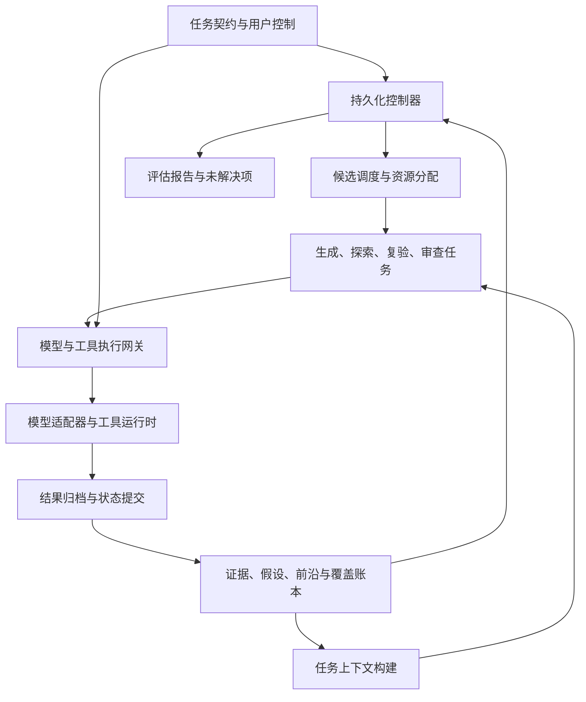

我建议把它设计成一套**持久化、证据驱动的开放探索系统**：模型负责提出和检验假设，程序负责保存进度、分配探索机会、约束执行，以及判断项目是否能够结束。

详细设计已经整理成文档，包含数据模型、接口、调度伪代码、恢复协议和故障验收：

[](sandbox:/workspace/scratch/9d120e57c77f/Open-Search-Agent-Architecture-v0.2.md)

下面展开其中最重要的设计。这是一份可以据此开发的架构方案，尚未实现运行引擎。

---

**一、先明确：这个系统究竟要持续什么**

你需要持续保存的，并不只是“当前任务还没完成”，而是以下五类东西：

1. 已经获得了哪些证据。
2. 哪些假设仍然值得检查。
3. 哪些方向因为缺少条件而暂时受阻。
4. 哪些重要区域还没有得到足够检查。
5. 接下来什么行动最值得消耗资源。

因此，系统的主状态不能放在聊天记录或某个 Agent 的待办清单里。

我建议明确区分两个层次：

| 层次                   | 生命周期            | 负责什么                    |
| -------------------- | --------------- | ----------------------- |
| **Campaign：整个验证项目**  | 可以跨会话、跨进程重启持续存在 | 范围、覆盖、证据、预算、所有探索分支、完成条件 |
| **TaskRun：一个局部执行片段** | 有限轮次、有限时间、有限费用  | 检查一个问题、补齐一个条件、复验一个结论    |

例如，一个 worker 完成了“检查这个现象的原因”，只意味着这个 TaskRun 结束。Campaign 还会检查其他候选、未完成的复验和覆盖缺口。

**让项目持续推进的责任放在程序里，局部推理和行动选择交给模型。**

双方的控制权应当明确：

| 决定            | 模型     | 程序          |
| ------------- | ------ | ----------- |
| 提出新的解释和探索方向   | 主要负责   | 检查结构、重复、范围  |
| 选择局部检查方法      | 主要负责   | 检查工具、条件和资源  |
| 判断观察可能意味着什么   | 提出判断   | 保存证据、检查判定协议 |
| 决定下一条分支获得执行机会 | 提供价值估计 | 最终调度        |
| 扩大权限、提高预算     | 不能自行决定 | 接受用户的版本化修改  |
| 宣布整个项目完成      | 可以建议   | 检查完成条件后转换状态 |

---

**二、总体架构：一个控制核心，多个可替换执行者**

建议首先采用模块化单体。下图中的模块不需要分别部署成服务。



这里有三个关键边界。

**第一，worker 不直接修改核心状态。**
它提交观察、假设修订和新候选，由提交服务检查后落库。

**第二，所有实际调用经过网关。**
包括探索、复验、检索改写、摘要、子任务和模型切换。否则预算和取消会出现旁路。

**第三，上下文根据任务重建。**
worker 不需要每次读取全部历史，也不需要继承一个越来越长的主对话。

多 Agent 在这个设计里承担并行和隔离职责。系统的核心正确性应当在单 worker 下就能成立。

---

**三、核心数据模型：把“观察、解释、行动、完成”分开**

建议先实现下面九类对象。

| 对象                | 保存什么                    | 为什么需要单独存在         |
| ----------------- | ----------------------- | ----------------- |
| **Campaign**      | 范围、目标、预算、政策版本、生命周期      | 防止局部执行结束影响全局      |
| **Observation**   | 原始结果、时间、身份、条件、工具版本、产物引用 | 保存实际观察，避免只剩总结     |
| **Hypothesis**    | 命题、适用条件、支持证据、反证、验证状态    | 允许解释变化和证据矛盾       |
| **FrontierItem**  | 待检查问题、前置条件、预期观察、成本、重开条件 | 保存尚未执行的探索机会       |
| **TaskRun**       | 一次局部执行的上下文、租约、额度、检查点    | 支持中断、换 worker 和继续 |
| **Attempt**       | 每次模型或工具调用的意图、状态、费用和外部效果 | 处理重复调用和崩溃恢复       |
| **CoverageItem**  | 哪项验证义务已测、未测、受阻或过时       | 防止只追逐容易出结果的区域     |
| **Verification**  | 如何复验、使用哪些证据、结果与限制       | 区分“怀疑存在”和“已经确认”   |
| **CapabilityGap** | 缺信息、工具、身份、知识还是权限        | 把失败转成具体依赖问题       |

其中最重要的是：

> **观察不等于事实解释，解释不等于已验证结论，工具执行完成不等于验证义务完成。**

例如：

* 观察：某个测试身份得到了一份返回结果。
* 假设：这可能表明访问规则存在不一致。
* 复验：独立检查确认结果与规定不符。
* 覆盖状态：这个条件组合已经检查，但其他身份和业务状态仍未测。

不能把这四步合并成一个 `success=true`。

图中的关系也要有明确语义：

* `supports`：支持某个解释。
* `contradicts`：与某个解释冲突。
* `requires`：需要某个前置条件。
* `unlocks`：获得这个条件后，可以开启哪些检查。
* `invalidates`：条件变化使哪些旧证据失效。
* `tests`：一次检查对应哪项验证义务。

初版用关系表即可，不必先引入图数据库。

---

**四、探索前沿：每个候选必须是一个可检验的问题**

“继续深入”“尝试其他办法”不能成为合格的候选任务。它们没有清楚的执行和停止边界。

一个候选至少应包含：

```text
问题：
    当前测试身份对样本对象的可见性，是否符合既定规则？

前置条件：
    测试身份可用
    样本对象存在
    当前规则版本已知

预期可区分的观察：
    符合规则
    不符合规则
    无法判定

结果去向：
    符合 → 保存当前条件下的证据
    不符合 → 创建独立复验任务
    无法判定 → 细化问题或记录阻塞

重开条件：
    身份发生变化
    样本版本变化
    规则版本变化
```

这样的候选具有三个优点：

1. 执行者知道要区分什么。
2. 调度器知道什么时候可以执行。
3. 失败以后知道什么时候值得回来。

前置条件需要支持 **AND/OR 关系**：

* 某次检查可能同时需要身份和样本。
* 获得样本可能有几条不同的允许路径。
* 一个前置条件可能同时解锁多个分支。

这使系统能够识别“当前最有价值的动作是补齐条件”，而不总是直接尝试最终目标。

还要检测依赖循环。例如 A 等 B，B 又等 A，且没有外部入口。此时应记录依赖阻塞，不能无限生成新的子任务。

---

**五、真正决定探索广度的，是候选生成机制**

只设计一个优秀调度器还不够。**调度器无法选择从未被提出的方向。**

因此，候选应来自不同的问题来源：

| 来源        | 必须回答的问题         |
| --------- | --------------- |
| 覆盖缺口      | 哪些已知对象和条件还没有检查？ |
| 证据延伸      | 新观察还支持哪些可检验解释？  |
| 反例与矛盾     | 当前结论在哪些条件下可能失效？ |
| 前置条件分析    | 缺少什么，阻止了多个方向？   |
| 差异分析      | 两个相似对象为何表现不同？   |
| 外部知识与历史方法 | 有哪些适用方法尚未考虑？    |
| 盲区审查      | 哪个重要维度一直没有候选？   |

这里可以使用相同模型执行不同任务，不必一开始就部署多个模型。但要承认：不同提示词并不能保证真正独立的思考。

程序还应检查候选的“新颖性”来自哪里：

* 新对象。
* 新条件。
* 新关系。
* 新方法。
* 新反证。

单纯换措辞、换角色名、把同一任务拆成很多小任务，不应增加调度配额。

另一个容易遗漏的问题是：**生成器可能靠自己的输出形成无限循环。**

例如：

1. 审查生成一个新假设。
2. 新假设让“知识版本”变化。
3. 系统因此再次审查。
4. 审查再生成一个近似假设。

解决办法是单独维护“实质进展代次”。只有有效观察、前置条件、证据等级或覆盖结果发生变化才推进它。候选、摘要和反思文本本身不重置停滞计数。

---

**六、调度策略：广度、深度、复验、回访都必须得到机会**

建议四个业务队列：

| 队列       | 作用           | 初始服务份额示例 |
| -------- | ------------ | -------: |
| **覆盖探索** | 检查未覆盖区域      |      35% |
| **证据深入** | 跟进有根据的线索     |      30% |
| **证伪复验** | 确认发现、处理反证与冲突 |      25% |
| **条件回访** | 重新打开历史受阻方向   |      10% |

这些比例是原型参数，并没有证据证明它们最优。份额应按资源消耗近似计量，不能只数任务个数。

调度分三步。

**第一步：准入。**

检查：

* 当前行动是否获准。
* 前置条件是否成立。
* 关键证据是否仍有效。
* 资源是否存在冲突。
* 是否有足够预算。
* 是否已经取消。
* 这是否是没有理由的重复尝试。

高优先级不能绕过这些条件。

**第二步：公平分配。**

队列有服务份额，队列内部的稳定分支也有轮转机会。

仅仅限制“同一分支不能连续执行”还不够：两个高优先分支可以轮流占满所有资源，让第三个分支永久等待。

一个可实现的初始规则是：

* 每个有合格任务的队列获得最低服务机会。
* 每四次常规派发后，下一次优先服务最久没有获得机会的合格分支。
* 归档候选保留等待年龄，并参与定期回访。
* 昂贵分支可以积累额度，避免低成本任务永远胜出。

这些保证都受预算和执行条件限制，不能承诺有限资源服务无限候选。

**第三步：在分支内部排序。**

考虑以下因素：

| 因素    | 判断重点          |
| ----- | ------------- |
| 覆盖价值  | 是否填补重要验证缺口    |
| 区分能力  | 不同结果能否明显改变判断  |
| 解锁价值  | 能否让其他分支获得执行条件 |
| 证据基础  | 是否有可靠线索支持继续   |
| 方法差异  | 是否真正采用不同检查思路  |
| 等待程度  | 是否长期没有获得机会    |
| 成本与重复 | 是否值得再次付出资源    |

首版不需要复杂的“成功概率公式”。模型自报的 80% 成功率并不是校准概率。

每次选择应记录：选了谁、为什么、哪些候选没选、当时剩余多少资源。这样才能解释调度错误。

---

**七、worker 应当短任务化，但进度要持续提交**

建议四类逻辑任务：

* 生成候选。
* 执行探索。
* 独立复验。
* 审查覆盖与盲区。

每次任务得到一个专门构建的上下文包：

| 内容               | 装载规则           |
| ---------------- | -------------- |
| 范围、权限、预算、返回协议    | 必须携带，不能因压缩而删除  |
| 当前问题和预期观察        | 必须携带           |
| 支持证据与反证          | 同时考虑，避免只召回支持材料 |
| 相关失败记录           | 带失败条件与重开条件     |
| 邻接对象和依赖进展        | 按任务相关性加载       |
| Skills、工具详情、外部知识 | 按需展开           |

原始结果放在产物存储里。模型获得摘要、引用和取回入口；摘要本身不能替代原件。

worker 应持续产生结构化进度，而不是在最后一次回答里集中总结：

```text
新的观察
假设修订建议
新的候选
已经排除的条件组合
当前阻塞
可恢复检查点
下一次唤醒条件
局部结束原因
```

这样，即使最后的总结失败，已经执行并归档的工作仍然存在。

“返回 JSON 无法解析”应当成为协议错误，允许有限修复；不能因此把阶段标成完成。

---

**八、恢复设计：必须处理“操作发生了，但记录没写完”**

这是长期运行系统最关键的故障场景之一。

例如：

1. 工具已经改变外部状态。
2. worker 在保存结果前崩溃。
3. 调度器发现租约过期。
4. 新 worker 重新执行相同操作。

只有数据库和心跳，仍然可能发生重复效果。

建议执行协议如下：

1. **先记录意图。** 保存 Attempt、调用标识、费用预留。
2. **执行前复查。** 检查取消、权限、任务代次和关键条件。
3. **发出调用。** 保存执行 ID，跟踪运行状态。
4. **持续归档。** 工具输出和进度不依赖最终模型总结。
5. **结果提交。** 保存观察、结算费用、发出事件。
6. **恢复时先核对。** 判断外部执行是否发生、是否仍在运行。

| 恢复时看到的状态     | 应当怎么做                |
| ------------ | -------------------- |
| 明确尚未发出       | 可以重新准入               |
| 已知执行 ID，仍在运行 | 重新挂接或等待              |
| 已完成，结果可查询    | 取回结果并补交              |
| 可能执行过，但无法确认  | 保留 `uncertain`，不盲目重发 |
| 支持幂等提交       | 使用同一幂等键核对或恢复         |

SQLite 可以提供本地事务原子性，但外部工具效果不会自动进入同一个事务。因此，本设计不承诺任意外部操作都能“精确执行一次”。[SQLite 原子提交说明](https://sqlite.org/atomiccommit.html)

还需要一个**租约代次**：

* 新 worker 接管后，旧 worker 的代次失效。
* 网关拒绝旧 worker 发起的新动作。
* 旧 worker 迟到的观察可以保存，但不能覆盖新状态。

已经发往外部的动作不一定能撤回。相应资源也不能仅因 worker 租约过期就立即释放给另一个冲突实验。

---

**九、“不轻易放弃”要体现为失败分类和条件回访**

建议至少区分：

| 失败类型     | 后续处理             |
| -------- | ---------------- |
| 工具暂态故障   | 有限退避重试           |
| 观察无效     | 修复取证或解析方法        |
| 缺少前置条件   | 创建依赖任务，其他分支继续    |
| 缺少能力     | 记录能力缺口，尝试获准的补齐方式 |
| 当前条件下的反证 | 保存条件化结论          |
| 结果无法判定   | 设计更有区分力的检查       |
| 外部效果不明   | 先核对，不当普通错误重试     |
| 同条件重复无进展 | 暂缓并保留重开条件        |

尤其要避免：

> 一次尝试失败 → 整个方向不可行。

也要避免：

> 一次尝试失败 → 原样再试，直到耗尽资源。

值得回访的分支应保存：

* 当时成立的条件。
* 已取得的证据和产物。
* 哪些条件组合尝试过。
* 为什么暂缓。
* 什么变化值得重新打开。
* 恢复时先检查什么。

这借鉴了 Go-Explore 的“保存有希望的状态，再回来继续探索”原则。实际系统中的回访需要重新确认条件，不能假设环境可以任意重置。[Go-Explore 原论文](https://arxiv.org/abs/2004.12919)

---

**十、安全验证的完成条件，需要覆盖账本和证据门槛**

覆盖账本记录的是**验证义务**，例如：

* 某类对象。
* 某种身份。
* 某个业务状态。
* 某条信任边界。
* 某类检查要求。

不要机械展开全部组合，只生成有适用依据的检查。

每个覆盖项应分开记录：

```text
是否适用
是否已经检查
是否存在疑似问题
是否已经确认
证据是否仍有效
是否存在明确排除条件
```

因此：

* “已经测试”不等于“安全”。
* “没有观察到问题”不等于“不存在问题”。
* “受阻”不能计入已测。
* “已确认一个问题”不能自动完成其他义务。

复验也应有层次：

| 层次                 | 能说明什么        |
| ------------------ | ------------ |
| 只有模型主张             | 可以成为候选       |
| 有原始观察和条件           | 可以成为线索       |
| 通过领域判定或独立方法交叉检查    | 可以确认规定条件下的结果 |
| 满足任务要求的独立复现并处理关键反证 | 可以支持更高要求的结论  |

多个模型对同一摘要投票，不能自动替代独立证据。

整个项目的完成判断，可以写成一个程序谓词：

```text
必做覆盖项已按政策处理
并且必要结论达到证据门槛
并且没有未分诊的重要对象或提案
并且没有待完成的必要复验
并且没有影响结论的未核对执行
并且当前快照的覆盖审查通过
并且提交时范围和关键状态版本没有变化
```

关闭期间还要设置事件水位：处理完水位前收到的相关结果和提案，再提交完成快照。

否则会出现一个隐蔽错误：新证据已经到达，但尚未变成覆盖项，项目先被判定完成。

---

**十一、预算、取消和权限必须形成同一道执行边界**

所有角色使用同一个根预算，子任务只获得其中的份额。

累计型资源可以按下面的守恒关系管理：

```text
未分配额度
＋任务未使用额度
＋在途调用预留
＋未知费用负债
＋已经消耗
＝总额度
```

一次调用从“预留”转为“未知负债”时，是转移，不是新增一笔。否则会重复计账。

其他资源分别处理：

| 资源            | 控制方法      |
| ------------- | --------- |
| 费用、token、调用额度 | 累计账本      |
| 并发            | 当前占用与信号量  |
| 请求速率          | 时间窗口或令牌桶  |
| 墙钟时间          | 绝对截止时间    |
| 产物空间          | 当前占用与待写预留 |

建议预留一部分资源用于复验、执行核对和报告。发现不断增加时，还应预留对应复验能力，不能最后只剩下一堆无法确认的主张。

用户控制也要区分：

* **Hint**：补充信息或改变优先级。
* **Pause**：停止新动作，按策略处理在途任务。
* **Cancel**：终止当前运行，禁止自动重开。
* **修改范围或预算**：形成新版本，重新检查后续动作。

取消以后，默认只归档已经到达的结果，并对已有执行发出停止请求。不能为了“继续善后”悄悄调用新的探索工具或总结模型。

---

**十二、第一台原型应该做到什么**

我建议从以下组合开始：

| 部分     | 首版选择                |
| ------ | ------------------- |
| 控制器    | Python 模块化单体        |
| 状态存储   | SQLite              |
| 原始证据   | 本地内容寻址产物目录          |
| 调度     | 四队列、稳定分支、公平机会       |
| worker | 一个探索 worker，加复验任务   |
| 模型     | 先用固定脚本策略检查协议，再接模型   |
| 环境     | 局部可观测的合成世界          |
| 用户入口   | CLI                 |
| 后续并发   | 增加第二 worker 检查冲突与取消 |

原型中的合成世界，应包含：

* 需要多个前置条件才能打开的分支。
* 会误导判断的表面线索。
* 暂态工具故障。
* 重复尝试的死循环。
* 条件变化后重新可行的历史方向。
* 工具完成后、结果提交前的崩溃。
* 两个 worker 对共享状态的冲突。

第一轮验收应证明这些具体行为：

1. 一个 worker 结束后，项目还能继续处理其他方向。
2. 同样的失败不会被无限重复。
3. 新条件出现后，旧分支能够重新打开。
4. 崩溃恢复不会盲目重复外部效果。
5. 没有原始证据的结论不能被确认。
6. 子任务、摘要和复验都受总预算控制。
7. 用户取消后，探索不会被自动唤醒。
8. 未处理的重要义务能够阻止错误的完成声明。

这套设计最值得先检验的，是**持久状态、候选多样性和调度公平带来的有效探索增量，能否抵得过上下文构建、审查、复验和状态管理的开销**。详细文档已经把这项检验拆成实现阶段和故障用例，可以直接作为原型开发的起点。
